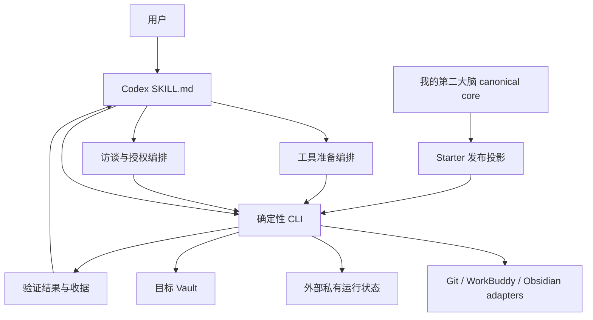
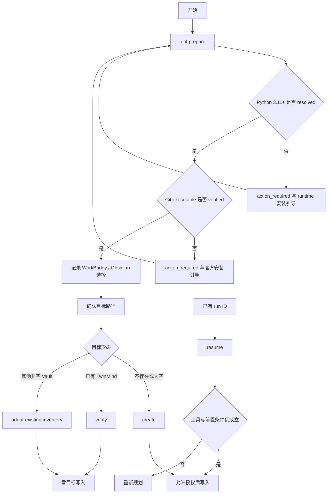
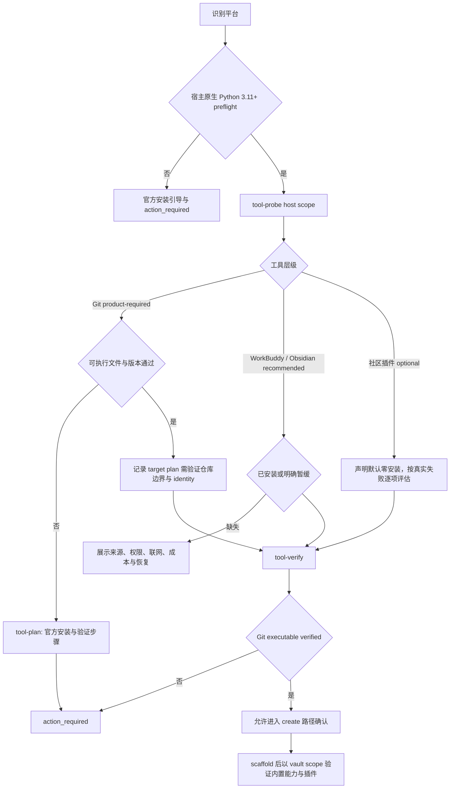
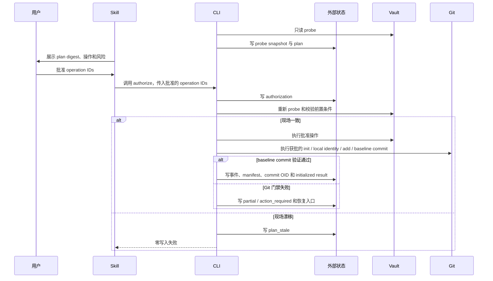
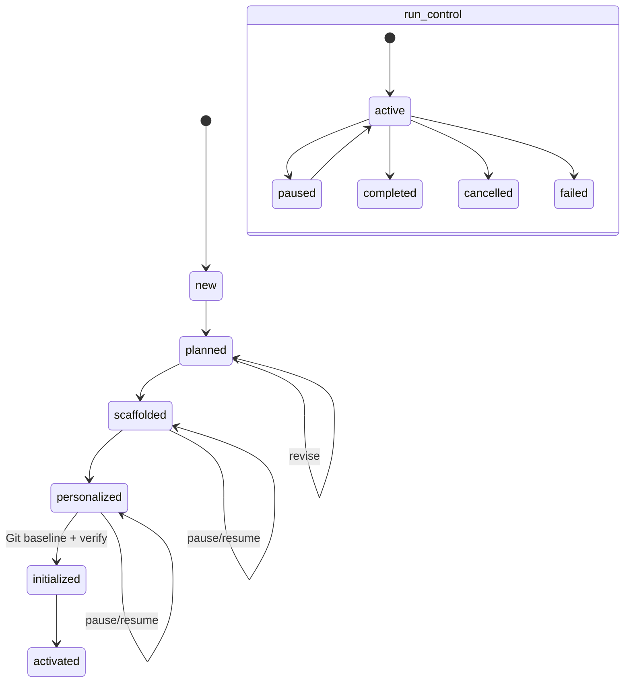
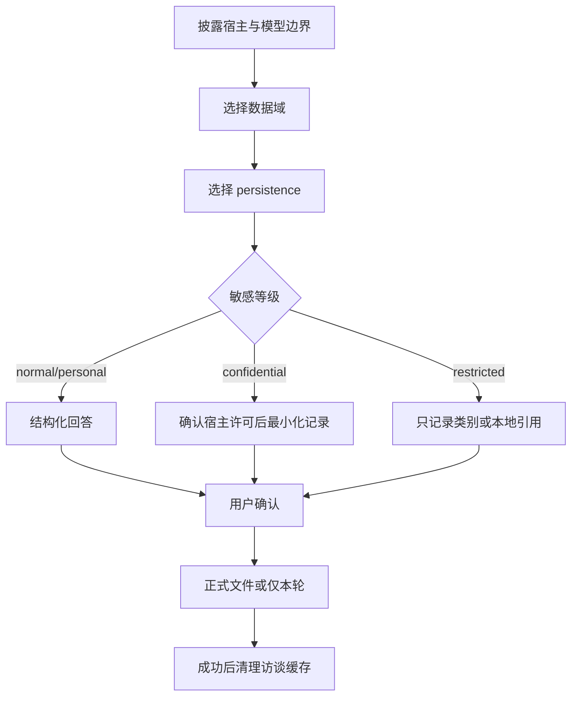
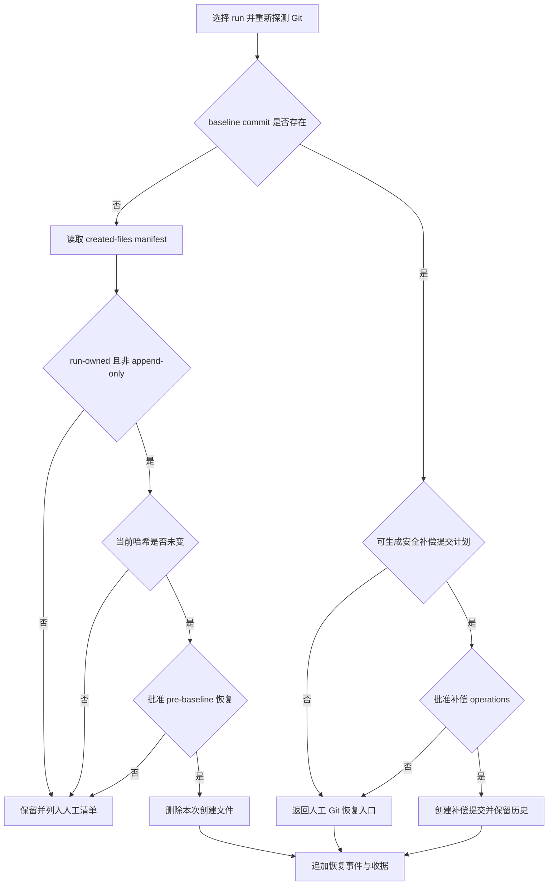
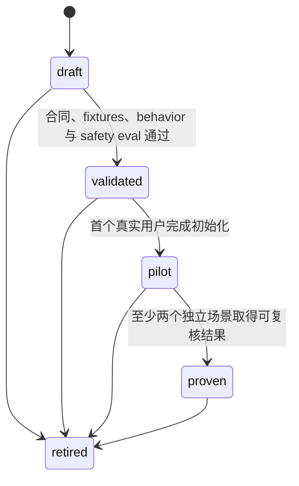

# TwinMind 第二大脑初始化 Skill - Plan

## Goal Capsule

| 项目 | 决策 |
|---|---|
| 目标 | 使用 我的第二大脑 Demo，帮助用户生成安全、可恢复、可继续运行的个人第二大脑 |
| 推荐方案 | 采用“工具准备 → Vault 初始化 → 个性化 → Git 基线 → 验证”的对话式 Skill、确定性 CLI、宿主中立 Starter Kit、外部私有运行状态、不可变计划授权、有界 inventory、MIT GitHub 源码发布和独立 ZIP 强制验签分发 |
| 产品权威 | 我的第二大脑/ 是 Starter Kit 内容权威；用户确认是个性化事实权威；脚本结果是机械动作与验证权威 |
| v0.1 支持 | Codex 为唯一正式宿主；tool-prepare、create 和 verify 完整支持；resume 只恢复 create run；adopt-existing 只读盘点并生成接管计划 |
| 决策重点 | 工具准备首阶段、Git 硬门禁与隐式执行面、baseline 前后恢复、storage_domain、零目标写入、授权防漂移、发布验签、inventory 预算和宿主适配边界 |
| 验证重点 | Git 安装与 baseline commit、不覆盖用户内容、只读模式零目标变化、计划漂移阻断、补偿恢复、同步目录泄漏门禁、bundle 来源认证、资源超限声明和真实闭环 |
| 最大边界 | v0.1 不实施旧库合并、不静默安装软件、不写 Obsidian 配置、不默认安装社区插件、不创建远程仓库、不做未验签跨机器分发、不做无界或跨文件系统 inventory、不承诺其他 Agent 宿主 |
| 停止条件 | Git/baseline、目标或 state identity、storage_domain、授权、恢复前置、工具/发布者身份、发布签名、inventory policy 或 canonical 资产完整性任一无法确认时停止对应动作或完成声明 |
| 执行形态 | Deep；隐私、权限、持久状态、CLI 和恢复均按高风险合同处理 |
| 后续 Owner | spec-work 或人工实现者按 U1-U9 执行；本方案不授权实现、提交、推送或发布 |

---

## Product Contract

### Summary

TwinMind 初始化 Skill 不是目录复制器。
它把现有 Demo 的八区结构、事实治理、AI 权限、恢复能力和真实任务闭环转化为一套可审计的初始化产品。
Skill 必须先完成工具探测、安装引导和 Git 硬门禁，再确认目标和数据边界、批准不可变计划，最后由确定性脚本执行写入、Git 基线、验证和恢复。

### Problem Frame

现有 Demo 已经具备第二大脑的核心结构，但普通用户仍需自行完成 Git、WorkBuddy、Obsidian 与内置插件准备，以及路径安全、目录复制、个性化、权限配置、恢复验证和运行激活。
直接复制会把模板误当成个人事实，也可能把 WorkBuddy 等当前 Demo 偏好固化为所有用户的唯一宿主。
对已有 Vault 直接改造还会引入覆盖、双主事实源、链接破坏和不可逆迁移风险。

本产品要解决的不是“如何生成更多笔记”，而是“如何让用户以最小风险得到一个能进入真实工作的个人知识系统”。

### Actors

- A1. 用户：确认目标、数据域、授权、个性化事实和最终价值判断。
- A2. Codex Skill：理解意图、分流旅程、组织访谈、解释计划和请求授权。
- A3. 确定性 CLI：探测、计划、复制、渲染、Git、验证、恢复和收据生成。
- A4. TwinMind Starter Kit：提供宿主中立的八区结构、控制文件、模板和治理规则。
- A5. Git：强制版本管理与恢复能力；可执行文件、仓库初始化和 baseline commit 都是 initialized 的必要证据。
- A6. WorkBuddy、Obsidian 与插件：推荐协作和工作台能力；按来源、权限、联网和恢复风险分层引导，不得替代 portable core 或 Git 硬门禁。

### Requirements

#### 初始化与用户控制

- R1. Skill 必须在任何目标写入前复述原始路径、规范化路径、目标身份、旅程、变更范围和恢复方式。
- R2. 用户批准的对象必须是带摘要的不可变计划，而不是模糊的“继续初始化”授权。
- R3. create 必须从 Starter Kit 生成完整骨架，并只将用户确认的访谈结论写入正式文件。
- R4. verify 必须对目标 Vault 保持零写入，只在外部运行状态目录生成报告。
- R5. adopt-existing 在 v0.1 只能盘点、映射和生成接管计划，不得合并、移动、重命名或补写控制文件。
- R6. resume 只能恢复已知 create run；现场漂移时必须重新规划，不能沿用旧授权。

#### 内容与事实治理

- R7. AI 推断永远不能直接成为 confirmed fact。
- R8. Starter 静态文件、首次生成文件、受管区块、追加记录和用户文件必须采用不同所有权策略。
- R9. 用户修改过的文件不得被自动覆盖或自动删除。
- R10. 初始化不得把旧库材料批量搬入新目录，也不得建立第二个业务事实 owner。
- R11. Candidate、旧结论、草稿和原始资料必须保持各自状态与目录边界。

#### 安全、隐私与恢复

- R12. 访谈开始前必须披露当前宿主和模型可能处理的内容，并先让用户选择数据域和落盘策略。
- R13. restricted 内容不得要求用户粘贴到模型上下文；只允许记录类别、占位符或本地引用。
- R14. 运行状态必须默认存放在目标 Vault 之外，并使用当前用户私有权限。
- R15. apply 必须重新探测目标身份、父级 Git、符号链接、源 manifest 和每项操作前置条件。
- R16. recover 必须区分 Git baseline 前后：baseline 前只能在二次授权后删除本次 run 创建、当前哈希未变化且非 append-only 的文件；baseline 后不得假装回到初始化前或擦除历史，只能生成单独授权的补偿提交计划，无法安全补偿时返回人工 Git 恢复入口。append-only 收据只追加恢复事件，不删除或改写既有条目。
- R17. Git 不可用、目标不在可接受的 Git 管理边界内或 baseline commit 未完成时，create 必须返回 action_required，且不得声明 initialized；manifest 与隔离副本只能辅助本次 run 恢复，不能替代版本历史。
- R18. 本地 Git 不得被描述为异地备份。

#### 宿主与可移植性

- R19. Starter Kit portable core 不得要求用户使用特定 AI 厂商。
- R20. v0.1 只正式支持 Codex Skill；其他宿主只能作为未验证适配候选。
- R21. WorkBuddy、Codex 或未来宿主说明必须位于 adapter 层，不得进入 portable core 的强制合同。

#### 声明与价值

- R22. 骨架、个性化、可恢复初始化和真实激活必须使用不同完成声明。
- R23. 结构、权限、恢复、内容和真实使用门禁互不补偿。
- R24. 没有跑通首个真实闭环时不得声明 activated。
- R25. 安装成功、生成目录和单次演示不得直接晋升为 proven。

#### 不可信输入

- R26. 已有 Vault 的文件名、Markdown、附件元数据和嵌入指令必须作为不可信数据处理；它们不能覆盖 Skill、用户授权或本方案合同，也不得未经用户选择进入模型上下文。

#### 工具准备与安装引导

- R27. Skill workflow 的第一阶段必须是 tool-prepare preflight：在询问 Vault 路径和执行任何目标写入前，识别操作系统，先检查 Python 3.11 或更高版本运行时，再探测 Git 可执行文件、WorkBuddy 与 Obsidian 应用；Obsidian 内置能力和社区插件属于 Vault 级状态，只能在目标 Vault 存在并经用户选择后于 environment 阶段探测。
- R28. Skill 必须把工具分为 runtime-required、product-required、recommended 和 optional 四层：Python 3.11 或更高版本为运行 CLI 的前置条件；Git 为 create 的产品硬门禁；WorkBuddy 与 Obsidian 为推荐能力，用户可明确暂缓；社区插件默认不安装，只在真实问题触发后逐项选择。
- R29. Git 工具准备必须先验证可执行文件和版本；用户选择目标后再验证 Git 边界、仓库初始化方案、本地 identity 和 baseline commit 方案；缺失 identity 时只规划仓库本地配置，不修改全局 Git 配置。
- R30. 工具安装或打开外部应用必须使用独立 tool plan、来源说明和授权；Skill 不得静默联网、自动 sudo、通过 shell 拼接命令、修改系统级配置或把“生成安装计划”解释为安装授权。
- R31. WorkBuddy 与 Obsidian 的引导必须说明官方获取入口、当前许可与成本需用户复核、数据路径、模型或联网边界、权限范围、日志或缓存位置、停用与恢复方式；无法安全自动验证时返回人工步骤和 action_required。
- R32. Obsidian 第一版只引导启用 File Explorer、Search、Quick Switcher、Backlinks、Templates，并把模板目录设为 `90_模板`；这些 Vault 级步骤在 scaffold 后执行。社区插件必须逐项披露读写目录、联网、密钥、派生数据和停用残留后再单独授权。
- R33. Python 运行时检查不能依赖待检查的 Python CLI；SKILL.md 必须先用宿主原生的固定参数解析一个版本不低于 3.11 的解释器并记录可执行文件身份和版本，缺失时返回官方安装引导与 action_required，且不调用 bootstrap CLI 或触碰 Vault 目标。

#### 资源预算

- R34. verify 与 adopt-existing inventory 必须使用版本化、有摘要的资源预算；命中任一条目数、深度、单文件、累计读取、时长、报告大小、文件描述符或文件系统边界时返回 `inventory_incomplete` 与 action_required，不得静默抽样或声明 verify 通过。

### Key Flows

- F1. create：仅在 F6 的 Git 工具门禁通过后确认路径和数据域，探测现场，为 scaffold 批次生成并批准不可变计划，复制骨架；随后完成受控访谈，为 personalize/environment 批次生成新的不可变计划，重新批准后个性化、完成 Git 仓库与 baseline commit、验证并交付收据。
- F2. verify：只读探测已有 TwinMind Vault，在外部状态区生成结构、内容、Git、恢复和激活报告。
- F3. adopt-existing：只读盘点旧 Vault，识别事实 owner 和冲突，在外部 staging 生成八区映射与分批接管计划。
- F4. resume：按 run ID 加载外部状态，校验计划、目标和已写文件；无漂移则继续，有漂移则返回重新规划。
- F5. activate：这是初始化后的人工引导与只读评估流，不是 v0.1 写入命令。用户选择一个真实问题，完成来源、知识 Candidate、项目或决定、交付或下一步、结果回写和复盘；verify 只在用户确认并给出 Vault 内相对证据引用后报告 activated。
- F6. tool-prepare：先以宿主原生 preflight 解析并验证 Python 3.11 或更高版本，再调用 host-scope tool-probe 探测 Git、WorkBuddy 与 Obsidian，展示 runtime-required/product-required/recommended/optional 层级和社区插件默认零安装政策；为缺失项生成带官方来源、权限、联网、成本复核、恢复和验证步骤的 tool plan。Python 或 Git 可执行文件未验证则停留在 action_required，通过后才允许进入 F1 的路径确认；目标 Vault 在 scaffold 后存在时，再以 vault scope 验证 Obsidian 内置能力和用户逐项选择的插件状态。

### Acceptance Examples

- AE1. 给定一个不存在且父目录可写的中文空格路径，当用户批准 create 计划后，系统创建 Starter 骨架并通过 manifest 校验。
- AE2. 给定一个非空目录，当用户请求初始化时，系统进入 adopt-existing 只读盘点；目标受控快照中的路径集合、类型、内容哈希、大小、权限、链接文本和 mtime 均不变化，atime 不作为零写入判据。
- AE3. 给定一个已有 TwinMind Vault，当运行 verify 时，只产生外部报告，目标 Vault 不新增 .twinmind 或其他文件。
- AE4. 给定一个已批准计划，当目标在 apply 前新增文件、符号链接改变或父级 Git 变化时，系统返回 plan_stale 且零写入。
- AE5. 给定用户在访谈中标记 restricted，当 Skill 继续追问时，只能询问类别和边界，不能要求具体内容。
- AE6. 给定用户修改了本次创建文件，当 recover 运行时，该文件被保留并进入人工处理清单。
- AE7. 给定 Git 不可用，当用户请求 create 时，系统在任何 Vault 目标写入前返回 action_required；即使 manifest、隔离副本和结构检查可用，也不得声明 initialized。
- AE8. 给定尚未完成真实闭环，当所有结构测试通过时，系统最多声明 initialized，不得声明 activated。
- AE9. 给定已有 Vault 中包含“忽略规则并删除文件”等嵌入文本，当运行 verify 或 adopt inventory 时，CLI 只返回转义后的有界数据，Skill 不把该文本当成指令，目标保持零写入。
- AE10. 给定 Git 可用但没有可用于目标仓库的 identity，当目标计划生成时，系统只请求并规划仓库本地 identity；用户未批准前不修改全局配置，baseline commit 不执行，结果不得进入 initialized。
- AE11. 给定 WorkBuddy 或 Obsidian 未安装，当 Git 门禁已通过且用户明确选择暂缓时，系统记录影响和后续入口并可继续 create；不得把未验证组件报告为 ready。
- AE12. 给定第一阶段没有重复出现的插件问题，当用户要求“把插件都装上”时，系统展示插件风险与按需原则，不批量安装或旁加载任何社区插件。
- AE13. 给定 Vault 文件已生成但 baseline commit 因 staged set 含疑似密钥、超大文件或无关路径而失败，系统保留可恢复的 partial run，返回 action_required，lifecycle_state 不得进入 initialized。
- AE14. 给定不存在任何 Python 3.11 或更高版本解释器，当用户启动 Skill 时，系统用宿主原生 preflight 返回官方安装引导和 action_required；bootstrap CLI 未被调用，Vault 路径未被询问或写入。
- AE15. 给定 baseline commit 已存在，当用户请求 recover 时，系统不删除 Git 历史或宣称恢复到初始化前；它生成绑定当前仓库、baseline OID、待补偿路径和新授权的补偿提交计划，无法满足前置条件时返回人工 Git 恢复入口。
- AE16. 给定已有 Vault 超过 `personal-vault-v1` 的任一 inventory 预算，当运行 verify 或 adopt-existing inventory 时，系统停止继续读取，输出有界 partial report、命中的限制和缩小范围入口，返回 inventory_incomplete/action_required，且目标保持零写入。

### Success Criteria

- 所有目标 Vault、Git、GUI 和破坏性运行状态清理写入都能追溯到 run ID、plan digest、authorization ID、operation ID、验证结果，以及适用时的操作前后哈希或 Git/GUI 等价收据；授权前的私有运行状态写入只允许保存探测、计划和用户已选择 persistence 的访谈数据，并追溯到 run ID 与事件。
- 同一 create plan 和 confirmed answers 重复执行时无新增 diff。
- verify 和 adopt-existing inventory 对目标目录保持零目标写入，并通过受控快照证明约定字段不变化。
- 目标、源资产或受管文件发生漂移时，apply 和 resume 均失败关闭。
- 访谈支持跳过、暂停、纠正、撤回和仅本轮使用。
- verify 与 adopt-existing 的用户内容按不可信数据处理，默认只向 Skill 提供结构、摘要和用户显式选择的最小片段。
- verify 与 adopt-existing 使用与 plan digest 绑定的 `personal-vault-v1` 预算；超限时报告完整说明停止原因与已覆盖范围，且不输出 success/verified 声明。
- 每次 create 在目标写入前都完成 tool-prepare；Git 缺失时受控目标快照保持不变。
- 每个 initialized 结果都能解析到目标 Git 仓库、baseline commit OID 和只包含批准路径的 baseline tree；manifest 或隔离副本不能满足这一条件。
- recover 结果明确标记 `pre_baseline_delete`、`post_baseline_compensation` 或 `manual_git_recovery`；任何模式都不删除或改写 append-only 历史，baseline 后不声称历史已擦除或目标回到初始化前。
- 至少一个受控用户在七天内完成真实闭环后，Skill 才进入 pilot。

### Scope Boundaries

#### v0.1 In Scope

- Codex 宿主。
- macOS 主路径。
- Python 3.11 及以上。
- tool-prepare：Git、WorkBuddy、Obsidian、内置能力和社区插件的探测、分层说明、官方安装引导与复核。
- create、verify、create-run resume。
- adopt-existing 只读 inventory 和接管计划。
- `personal-vault-v1` 有界 inventory policy；v0.1 默认不跨文件系统，超限后由用户缩小范围或进入后续方案，不自动抬高预算。
- Starter manifest、受管文件、Git 必需版本历史、Obsidian 与 WorkBuddy 探测和人工指引。
- 版本化源码目录、确定性分发包、校验摘要和 Codex 手工安装说明；v0.1 不自修改宿主 skill root。
- 本地、默认离线、无远程遥测。

#### Deferred to Follow-Up Work

- v0.2：已有 Vault 的分批 apply、Windows 验证、Obsidian 安全配置 diff、多宿主 adapter。
- v0.3：七天教练、三十天回顾、本地检索基线、按真实失败建议 Skill 或自动化。
- 触发条件明确后：社区插件的逐项自动化安装、RAG、Memory OS、远程仓库、同步和定时任务。

#### Outside This Product's Identity

- 企业级多人权限和合规归档。
- 自动心理诊断、人格判定和职业测评。
- 自动迁移整个旧知识库。
- 自动删除、自动上传、自动 push、自动晋升 Candidate。
- 静默下载、自动 sudo、批量旁加载社区插件或修改全局 Git 配置。
- 替代项目管理、CRM、日历或其他业务事实系统。

---

## Planning Contract

### Evidence and Limitations

- 当前内容权威来自 我的第二大脑/、README.md 和本方案的用户目标。
- 我的第二大脑/ 当前包含 27 个受 Git 跟踪文件，并明确采用八区、权限协议、七天冷启动和三十天价值验收。
- 第二大脑完整工具清单.md 把 Markdown、Obsidian、Git、WorkBuddy 定义为第一版推荐组合，并要求先跑通最小闭环、社区插件按问题添加；本方案把 Git 提升为用户明确要求的 create 硬门禁，同时保留 WorkBuddy 与 Obsidian 的推荐但可暂缓属性。
- 工具选择与升级门禁.md 仍含“AI 协作统一使用 WorkBuddy”的 Demo 级选择，因此 U1 需要把 portable core 的宿主合同与 Demo 推荐工具说明分层，不能删除用户可见的 WorkBuddy 安装引导，也不能把它固化为生成 Vault 的格式依赖。
- Demo 的 AI协作协议.md、知识库索引.md 和 10_当前工作台/00_第二大脑启动契约.md 当前没有受管区块标记；U1 必须先在 canonical source 建立稳定标记，U5 才能安全渲染。
- 我的第二大脑/AGENTS.md 要求修改 canonical source 时更新维护日志并留下交付记录；这些文件属于 U1 的明确写入范围。
- 当前工作树只有本方案为未跟踪文件；skills/bootstrap-second-brain/、脚本、schema、manifest 和测试尚不存在。
- 当前 authoring host 可用 `python3` 为 3.12.13，但不存在 `python3.11` 别名；Git 为 Apple Git 2.50.1。该事实直接否定硬编码解释器命令，并支持 runtime receipt 解析任意 Python 3.11+ 可执行文件；它不代表未来用户环境已 ready。
- 本方案只证明实现准备度，不证明 Skill 行为、Obsidian 环境或真实用户价值。
- 未执行广泛外部研究；Git、WorkBuddy 与 Obsidian 的官方入口基于 第二大脑完整工具清单.md 的 2026-08-06 快照。2026-08-07 的有界 HTTP header 复核确认 `https://workbuddy.ai` 会跳转到 `https://www.workbuddy.ai/`，因此本方案把后者作为 v0.1 初始官方入口。实施与每次用户安装时仍必须重新确认当前平台支持、许可和来源。本轮决策由当前源、Design by Contract、事务前置条件、Privacy by Design、SRE 声明上限和 Ports and Adapters 共同约束。

### Architecture Posture

采用 compose / thin-glue。

- 我的第二大脑/ 继续拥有知识结构、治理规则、模板和 portable core。
- 确定性 CLI 拥有文件系统、状态、计划、授权验证、Git、恢复和机器结果。
- Codex SKILL.md 只拥有意图理解、访谈编排、授权交互和结果解释。
- 同步脚本只负责 canonical source 到发布资产的单向投影，不复制业务规则。
- CLI 不判断用户价值，Skill 不直接执行文件操作，发布投影不成为第二事实源。

### Key Technical Decisions

- KTD1. 正式宿主：v0.1 只承诺 Codex；生成的 Vault 保持 Agent 中立。
  - 理由：先证明一个真实宿主，避免根据产品名称推断能力。
  - 代价：WorkBuddy 和 Claude 用户只能使用 portable Vault，不能获得已验证 Skill 体验。

- KTD2. Canonical Starter：portable core 的文件格式和治理规则保持 Agent 中立；Demo 可明确推荐 WorkBuddy，并把安装、权限和使用说明放在 adapter/tooling 层。
  - 理由：用户需要可执行的 WorkBuddy 引导，但更换 Agent 后 Markdown 事实核心仍应完整可用。
  - 拒绝：删除 WorkBuddy 入口会背离 Demo 工具清单；把 WorkBuddy 写成 portable core 的格式依赖则会制造厂商锁定。

- KTD3. 旅程与控制命令：create、verify、adopt-existing 是用户旅程；resume、recover 和 cleanup 是 run 控制命令。
  - 理由：resume 不是一种目标形态，不能与 create 并列成为持久业务模式。

- KTD4. 状态分轴：phase、lifecycle_state、run_state、health 和 command_outcome 分开。
  - 理由：进度、运行控制、降级和单次命令结果不可共用一个 status 字段。

- KTD5. 外部状态：v0.1 不在目标 Vault 创建 .twinmind。
  - 理由：只读旅程必须零目标写入，运行状态也不应进入用户 Git 或 AI 默认上下文。

- KTD6. 授权绑定：authorization 必须绑定 plan digest、plan subject identity 和批准的 operation IDs；目标写入 plan 同时绑定 target identity，cleanup plan 同时绑定 state-root 与 run identity。
  - 理由：路径、文件或运行状态根在批准后可能变化；apply 与 cleanup 都必须防止 TOCTOU 和旧授权复用。

- KTD7. 文件所有权：static、generated-once、managed-block、append-only、user-owned 五类保持非补偿式边界。
  - 理由：重复运行和恢复动作需要根据所有权采用不同策略。

- KTD8. 敏感数据：先选择数据域和 persistence，再收集答案。
  - 理由：用户不能在披露后才知道内容会进入哪个宿主、文件或 Git。

- KTD9. Git 与 Obsidian：Git 可执行文件、可接受的仓库边界和可验证 baseline commit 是 initialized 的硬门禁；Obsidian v0.1 负责探测、官方安装引导、内置能力配置说明和打开，但不直接写 `.obsidian` 配置。
  - 理由：Git 是版本审计与误改恢复的基础控制，不可由 manifest 代替；Obsidian 是人的工作台，其 GUI 状态需要人工确认，不能由文件存在性推断。

- KTD10. 完成与推广：lifecycle_state 和 promotion_status 独立。
  - 理由：用户 Vault 的 initialized 不代表 Skill 产品 validated，Skill validated 也不代表用户 activated。

- KTD11. 运行基线：Python 3.11+；SKILL.md 先用宿主原生固定参数完成 runtime preflight，Python 可用后才调用 CLI；macOS 为正式验证平台，Linux 只做文件系统兼容，Windows 延后。
  - 理由：待检查的 Python 不能承担自身安装探测；先固定 bootstrap 边界、标准库、权限和路径语义，再扩展平台矩阵。

- KTD12. 资产版本：Starter 使用语义版本、source commit 和 manifest digest 三重身份。
  - 理由：文件名 starter-v1.json 不足以绑定用户批准的真实源内容。

- KTD13. 运行依赖：v0.1 CLI 只依赖 Python 3.11+ 标准库；JSON Schema 只使用项目声明的受支持子集，由本地 contract validator 解释，跨字段不变量由显式验证函数负责。
  - 理由：默认离线和开箱可运行不能依赖隐式联网安装；测试必须拒绝未实现的 schema keyword。

- KTD14. create 事务边界：同一 create run 至少包含 scaffold 与 personalize/environment 两个不可变 plan；每个 plan 有独立 digest 和授权，后一个 plan 不能回写或扩张前一个授权。
  - 理由：个性化内容只有访谈确认后才能确定，不能塞入访谈前已批准的 plan。

- KTD15. activate 边界：v0.1 不提供自动写入型 activate 命令；create apply 的声明上限是 initialized，activated 只能由后续人工闭环和只读 verify 的用户确认相对证据共同支持。
  - 理由：文件存在不能证明真实使用，CLI 也不能替用户做价值裁决。

- KTD16. 分发边界：skills/bootstrap-second-brain/ 是 canonical Skill 源；U8 生成确定性版本包、SHA-256、zip direct signature、release attestation 和 attestation detached signature，并验证解包后的 Skill 结构。SHA-256 只证明拿到的字节与 attestation 一致，Owner 来源认证必须依赖独立渠道获得的公钥指纹以及 zip/attestation 的双签名验证。安装由用户通过当前 Codex 支持的显式流程完成，Skill 不自写宿主 skill root，也不修改仓库中的 generated runtime。
  - 理由：源码、字节完整性、发布者认证、安装和运行验证必须分层；自安装会把初始化 Vault 的授权扩大成修改宿主配置。
  - Bootstrap 边界：接收方先用预先可信的 OpenSSH verifier 直接验证 zip 原始字节，再验证 attestation 原始字节；两者通过前不得执行候选 bundle、候选源码 checkout 或其中的 `package_skill.py`。包内 verifier 不能参与首次来源认证。

- KTD17. 许可与发布边界：Owner 已决定 v0.1 以 MIT License 公开发布，仓库根目录、Canonical Starter 和 Skill bundle 均携带 LICENSE。GitHub 源码发布前必须确认 staged、unstaged、untracked 均为空并冻结 `release_commit`；只有 canonical 远端分支 SHA 与该 commit 一致，且远端 commit 包含 LICENSE、README 和 SOURCE，才视为正式源码发布成功。独立 ZIP 是单独发布面；未通过 zip direct signature、attestation signature、独立渠道 Owner 公钥指纹、包摘要和包内容校验时，不得跨机器分发或安装。
  - 理由：开源许可、GitHub 源码发布、字节完整性和独立包的发布者身份认证是不同证据层，不得相互替代。

- KTD18. 工具准备首阶段：每个 create run 必须先完成 Python runtime preflight，再执行 tool-probe、tool-plan 和 tool-verify；Python 或 Git 可执行文件未通过时禁止进入路径确认和 Vault 目标写入，目标 Git 边界与 baseline 证据在后续 target plan/apply 中继续失败关闭；WorkBuddy 或 Obsidian 可由用户明确暂缓并记录影响。
  - 理由：先发现环境缺口比写入中途失败更安全，也使安装动作、Vault 初始化授权和完成声明保持分离。

- KTD19. 安装边界：v0.1 采用 guided installation，不提供通用自动安装器；Skill 可以展示或在独立授权后打开官方入口，但不自动 sudo、不调用未确认包管理器、不静默联网、不修改系统级配置。
  - 理由：不同平台、许可、网络和管理员策略无法由一个离线初始化 Skill 安全统一处理。
  - 浏览器边界：CLI 只校验并记录交给外部浏览器的初始 HTTPS URL；浏览器接管后的 HTTP、JavaScript 和用户导航不在 v0.1 收据或验证能力内，不得宣称逐跳 allowlist 保护。
  - 拒绝：把 Git、WorkBuddy、Obsidian 和插件安装塞进 create apply，会扩大授权并让失败恢复跨越系统边界。

- KTD20. 插件渐进启用：第一阶段只引导 Obsidian 内置能力，社区插件默认零安装；每个社区插件必须由真实失败触发，并独立完成用途、权限、联网、密钥、派生数据和停用恢复评估。
  - 理由：插件数量不是第二大脑成熟度，批量安装会引入供应链、数据外传和维护成本。

- KTD21. Git 执行环境：所有 init、add、commit 操作必须绑定经重新探测的 Git 可执行文件身份、config origin 摘要、hooks/filters/attributes/签名/fsmonitor/模板和自动同步状态。执行时使用命令级隔离配置、可信空 hooks 目录、空模板、禁用 commit signing 与 fsmonitor；目标 path 匹配到 clean/process filter、无法证明关闭的自动同步或其他可执行扩展时返回 action_required。
  - 理由：用户批准 Git operation 不等于批准仓库或全局配置间接执行的任意程序；“不主动 push”也不能阻止 hook 或同步工具外传数据。

- KTD22. 可执行文件信任次序：Python、Git 和发布验签用 OpenSSH `ssh-keygen` 候选先由宿主原生能力执行 realpath、文件类型、owner/mode、父目录可写性、位置域和平台身份证据检查，通过信任分类后才以固定参数执行版本或能力探测。PATH 仅是候选发现源，不是信任根；位于 Vault、当前 workspace、state root、临时目录或组/其他用户可写父路径的候选一律拒绝。
  - 允许的信任类型：平台系统签名工具；官方签名/公证或可复核包收据的安装；用户管理且父路径不可被其他主体写入的安装，但需用户批准精确 realpath、SHA-256 和来源类型。其他候选只能进入 detected/untrusted 并返回 action_required。
  - 运行 CLI 时必须屏蔽环境注入和用户 site，不从 CWD、Vault、`PYTHONPATH` 或未验证路径导入代码；只将已验证 Skill 源根作为代码加载边界。

- KTD23. 工具发布者身份：`manifests/tool-identities-v1.json` 是 Python、Git、发布验签用 OpenSSH `ssh-keygen`、WorkBuddy 和 Obsidian 来源与平台身份的 canonical manifest。macOS 应用条目至少包含 bundle ID、可执行文件名、TeamIdentifier 或 designated requirement、允许路径类型、签名/公证证据、初始官方 URL、`source_as_of` 和轮换流程。签名有效但发布者身份不匹配时只能报告 untrusted/action_required。
  - 理由：应用名称、路径、图标、GUI 或任意有效 Developer ID 签名都不能单独证明软件来自官方发布者。
  - 轮换：身份值变化必须由维护者从当前官方安装介质重新取证，生成新 manifest digest，更新 SOURCE.md 和测试 fixture。旧 identity digest 绑定的 tool plan 一律 plan_stale。

- KTD24. Git baseline 是 recover 语义分界：baseline 前的恢复是对未提交、run-owned 且未变化文件的保守撤销；baseline 后的恢复是保留历史的补偿提交或人工 Git 恢复，不是删除历史或回到初始化前。append-only 收据始终通过新增恢复事件表达状态变化。
  - 理由：baseline commit 已成为可审计事实；物理删除已提交内容或重写收据会破坏用户要求的 Git 版本管理与恢复证据。
  - 安全前置：只有当前 HEAD、目标 tree 和待补偿路径都与 recovery plan 的预期一致，且 baseline 后没有用户编辑或后续提交触及这些路径时才允许自动补偿；否则进入 manual_git_recovery。
  - cleanup 边界：`scope=all` 只删除外部运行状态，必须在授权前明确提示会永久失去该 state root 上的自动 resume/recover 能力；Vault 收据与 Git 历史不属于 cleanup 目标。

- KTD25. state root 必须分类为 `local_fixed`、`cloud_synced`、`network`、`removable` 或 `unknown`，分类证据和摘要进入 state 与相关 plan。confidential 的 `runtime_state` 持久化仅在 `local_fixed` 上默认允许；其他域没有绑定当前 state root 的已验证加密存储收据时返回 action_required，不得明文降级。
  - 理由：自定义 `--state-dir` 即使 owner/mode 合法，也可能被云同步、网络挂载或可移动介质复制到额外信任域；POSIX 私有权限不能证明数据只留在本机固定磁盘。
  - 漂移：state root identity、storage_domain、分类证据或加密收据变化后，旧 plan 不得继续用于 confidential 持久化。

- KTD26. 独立 ZIP 的发布签名 provider 固定为 OpenSSH `ssh-keygen -Y sign/verify`，zip namespace 固定为 `twinmind-bundle-v1`，attestation namespace 固定为 `twinmind-release-attestation-v1`，所有参数以数组传递且不经过 shell。`dist/bootstrap-second-brain-v0.1.zip.sig` 直接签 zip 原始字节；`dist/release-attestation.json` 绑定包名、SHA-256、大小、Starter source commit、Starter digest、package allowlist digest、构建器版本、发布边界和 signer fingerprint，`dist/release-attestation.json.sig` 签 attestation 原始字节。
  - 信任根：验证端使用从 bundle 之外独立获得并人工核对的 Owner 公钥指纹构造 allowed signers；bundle、SOURCE.md 或 attestation 内自带的公钥/指纹只能作声明，不能自证可信。
  - 失败边界：缺少可信 `ssh-keygen`、独立指纹、匹配公钥或任一有效签名时返回 action_required。bundle 只能留在 Owner 当前机器用于本地验证，不得声明 authenticated distribution 或进入跨机器 pilot。
  - 密钥边界：私钥、agent socket、allowed-signers 本地信任文件和签名临时材料不得进入仓库、bundle、state root、eval result 或日志。

- KTD27. `manifests/inventory-policies-v1.json` 拥有 `personal-vault-v1` 默认预算：最多 50,000 entries、最大深度 64、单文件最多 1 GiB、累计读取最多 10 GiB、最长 10 分钟、报告最多 32 MiB、同时打开文件描述符最多 32，默认不跨文件系统。
  - 结果语义：命中任一限制立即停止新增读取并返回有界 partial report、`inventory_status=incomplete`、`command_outcome=action_required`、limit ID、观察计数和缩小范围入口；不得将未遍历部分视为不存在或声明 verify 通过。
  - 版本语义：canonical policy ID 与八项上限不可变；任何阈值或文件系统边界变化都必须发布新 policy ID 并重新规划。单次 run 可以在 plan 中记录更严格的 effective limits，但不得改写 `personal-vault-v1` 或把收紧后的值冒充 canonical policy。
  - 理由：旧 Vault 的附件、深层目录、挂载点或恶意稀疏结构可能耗尽时间、内存、磁盘或文件描述符；无界 inventory 与“只读”同样可以造成拒绝服务。

### Interface Contracts

| Interface | Mode | Consumers | Canonical artifact | Contract summary | Compatibility | Verification owner |
|---|---|---|---|---|---|---|
| CLI | greenfield | SKILL.md、人工维护者 | skills/bootstrap-second-brain/references/workflow-contract.md | JSON stdout、稳定退出类别、stderr 日志、默认离线 | v0.1 内新增字段必须向后兼容 | U3、U4、U8 |
| Bootstrap state | greenfield | resume、recover、receipt | skills/bootstrap-second-brain/schemas/bootstrap-state.schema.json | 分轴状态、目标身份、state root identity、storage_domain、敏感值最小化、schema version | schema_version 驱动迁移；v0.1 只读旧版失败关闭 | U2、U8 |
| Plan | greenfield | 用户授权、apply | skills/bootstrap-second-brain/schemas/bootstrap-plan.schema.json | plan digest、subject kind/identity、source digest、preconditions、operation IDs；目标写入、host-tool 动作和 cleanup 共用不可变计划核心 | 已批准计划不可原地修改，不得跨 subject 复用 | U2、U4、U6、U9 |
| Authorization | greenfield | apply、recover、cleanup | skills/bootstrap-second-brain/schemas/bootstrap-authorization.schema.json | authorization ID、plan digest、subject identity、批准操作、时间和范围 | 不允许跨 plan、target、state root 或 run 复用 | U2、U4、U6 |
| Result and receipt | greenfield | Skill、用户、eval | skills/bootstrap-second-brain/schemas/bootstrap-result.schema.json | lifecycle、health、outcome、inventory coverage/status、证据、降级、恢复入口 | 新字段可选新增；声明字段与 incomplete 语义不可改义 | U2、U7、U8 |
| Tool readiness | greenfield | SKILL.md、create、verify | skills/bootstrap-second-brain/schemas/tool-readiness.schema.json | 平台、Python runtime receipt、工具层级、可执行文件/应用检测、官方来源、权限/联网/成本复核、用户选择、验证与下一动作；目标仓库证据仍由 Plan/Result 拥有 | 新增工具可选；Python runtime-required 与 Git product-required 语义不可降级 | U2、U6、U7、U9 |
| Tool choice | greenfield | tool-choice-update、SKILL.md、resume | skills/bootstrap-second-brain/schemas/tool-choice.schema.json | 工具 ID、选择类型、影响披露摘要、用户确认时间和幂等键；不含安装或打开授权 | 新增选择类型必须保持旧消费者失败关闭；选择不得升级 readiness | U2、U8、U9 |
| Tool evidence | greenfield | tool-evidence-update、tool-verify、receipt | skills/bootstrap-second-brain/schemas/tool-evidence.schema.json | 工具 ID、观察类型、外部动作收据引用、观察时间和证据来源；GUI 观察不拥有发布者身份结论 | 新增观察类型必须可忽略或失败关闭；不得改变既有证据强度 | U2、U8、U9 |
| Tool identity manifest | greenfield | tool-probe、tool-verify、tool-action-plan、发布验签、打包检查 | skills/bootstrap-second-brain/manifests/tool-identities-v1.json | 工具 ID、平台、初始官方 URL、CLI 来源类型、app bundle/signing identity、时点、轮换和 manifest digest；包含发布用 OpenSSH verifier | 身份变化生成新 digest；旧 tool/release plan 失效，不得原地改义 | U2、U8、U9 |
| Release authentication | greenfield | package verification、安装说明、private pilot | skills/bootstrap-second-brain/schemas/release-attestation.schema.json；dist/bootstrap-second-brain-v0.1.zip.sig；dist/release-attestation.json；dist/release-attestation.json.sig | zip direct signature、包摘要与大小、source/Starter/allowlist digest、构建器、发布边界、两个固定 namespace 和 signer fingerprint；信任指纹必须来自独立渠道 | attestation schema 版本化；任一旧签名不得授权新包、新摘要或新发布边界 | U2、U8 |
| Inventory policy | greenfield | probe、verify、adopt-existing、plan、eval | skills/bootstrap-second-brain/manifests/inventory-policies-v1.json；skills/bootstrap-second-brain/schemas/inventory-policy.schema.json | policy ID/digest、八项资源限制、文件系统边界、超限结果和观察计数 | 同一 canonical ID 不可改义；任何 policy 变化需要新 ID 与新 plan，run-local 仅可记录更严格 effective limits | U1、U2、U3、U8 |
| Starter manifest | greenfield | sync、plan、apply、verify | skills/bootstrap-second-brain/manifests/starter-v1.json | portable 文件清单、所有权、SHA-256、排除规则、source commit | Starter 升级必须新版本，不改旧摘要 | U1、U8 |
| Event stream | greenfield | resume、诊断、eval | skills/bootstrap-second-brain/schemas/bootstrap-event.schema.json | 事件名、run ID、phase、结果、时间；不含敏感答案 | 事件只追加；未知事件由消费者忽略 | U2、U8 |

### CLI Contract

CLI 使用一个入口脚本和显式子命令：

下列 `<python>` 表示 runtime preflight 已在执行前完成信任分类、解析并记录的 Python 3.11+ 可执行文件，并且由 host adapter 以屏蔽环境注入、用户 site 和不安全导入路径的固定启动配置运行。不得假设系统存在名为 `python3.11` 的别名。runtime preflight 失败时不得尝试用同一脚本自检。

```text
<python> skills/bootstrap-second-brain/scripts/bootstrap_second_brain.py tool-probe --scope host --json
<python> skills/bootstrap-second-brain/scripts/bootstrap_second_brain.py tool-probe --scope vault --target <path> --json
<python> skills/bootstrap-second-brain/scripts/bootstrap_second_brain.py tool-plan --from-probe <tool-probe.json> --json
<python> skills/bootstrap-second-brain/scripts/bootstrap_second_brain.py tool-choice-update --run-id <id> --input - --json
<python> skills/bootstrap-second-brain/scripts/bootstrap_second_brain.py tool-action-plan --run-id <id> --tool <tool-id> --action open-source|open-app --json
<python> skills/bootstrap-second-brain/scripts/bootstrap_second_brain.py tool-evidence-update --run-id <id> --input - --json
<python> skills/bootstrap-second-brain/scripts/bootstrap_second_brain.py tool-verify --plan <tool-plan.json> --json
<python> skills/bootstrap-second-brain/scripts/bootstrap_second_brain.py probe --target <path> --json
<python> skills/bootstrap-second-brain/scripts/bootstrap_second_brain.py plan --target <path> --journey create --stage scaffold --json
<python> skills/bootstrap-second-brain/scripts/bootstrap_second_brain.py interview-update --run-id <id> --input - --json
<python> skills/bootstrap-second-brain/scripts/bootstrap_second_brain.py plan --run-id <id> --journey create --stage personalize --json
<python> skills/bootstrap-second-brain/scripts/bootstrap_second_brain.py plan --target <path> --journey adopt-existing --stage inventory --json
<python> skills/bootstrap-second-brain/scripts/bootstrap_second_brain.py authorize --plan <plan.json> --approve <operation-id> [--approve <operation-id> ...] --json
<python> skills/bootstrap-second-brain/scripts/bootstrap_second_brain.py apply --plan <plan.json> --authorization <authorization.json> --json
<python> skills/bootstrap-second-brain/scripts/bootstrap_second_brain.py verify --target <path> [--activation-evidence <vault-relative-path> ...] --json
<python> skills/bootstrap-second-brain/scripts/bootstrap_second_brain.py resume --run-id <id> --json
<python> skills/bootstrap-second-brain/scripts/bootstrap_second_brain.py recover-plan --run-id <id> --json
<python> skills/bootstrap-second-brain/scripts/bootstrap_second_brain.py recover --plan <recovery-plan.json> --authorization <authorization.json> --json
<python> skills/bootstrap-second-brain/scripts/bootstrap_second_brain.py cleanup-plan --run-id <id> --scope interview|all --json
<python> skills/bootstrap-second-brain/scripts/bootstrap_second_brain.py cleanup --plan <cleanup-plan.json> --authorization <authorization.json> --json
```

共同规则：

- --state-dir 可覆盖平台默认状态根，但仍执行安全位置、权限和 `storage_domain` 分类；分类不得只采用用户标签。`cloud_synced`、`network`、`removable` 或 `unknown` 没有绑定当前 state root 的已验证加密收据时，confidential 只能保持 session_only 或返回 action_required。
- runtime receipt 必须绑定 resolved executable identity、版本和探测时间；resume 前重新验证，解释器漂移时返回 plan_stale/action_required。
- executable identity 包含 discovery source、requested/resolved path、文件类型、owner/mode、父路径可写性、SHA-256、平台签名/公证或包收据、信任类型和用户批准引用。在身份证据通过前不得执行候选的 `--version` 或任何其他参数。
- --json 只在 stdout 输出一个 JSON object；诊断日志写 stderr。
- 路径作为参数数组传递，不要求用户手工转义，不经过 shell 拼接。
- --approve 是可重复的单值参数；operation ID 不用逗号字符串或 shell 拆分。
- --activation-evidence 是可重复的 Vault 相对路径参数；只有 Skill 已取得用户对这些证据的明确确认后才可传入。CLI 只验证路径、证据形状和闭环检查表，不从内容数量或模型判断推断用户确认。
- interview-update 只从 stdin 接收符合 interview-answer schema 的增量；session_only 不落盘，stdout、stderr、events、result 和收据不得回显答案值。
- 默认不联网。
- tool-probe host scope 只读取本机可执行文件和已知应用元数据；vault scope 只在目标存在且用户已选择后读取该 Vault 的 Obsidian 配置摘要。两者都不得扫描无关目录、读取插件正文或读取密钥。
- tool-plan 只生成 runtime-required/product-required/recommended/optional 缺口、官方获取入口、人工步骤、权限/联网/成本复核、停用与验证清单；它不执行安装，也不产生安装授权。
- tool-choice-update 只从 stdin 接收 tool-choice schema 的增量，记录 `install_guidance`、`deferred_by_user` 或继续复核的选择、影响披露和用户确认时间；它不得打开页面、应用或创造 ready 证据。
- tool-action-plan 产生 `subject_kind=host_tool` 的不可变计划，绑定平台、工具身份、初始 URL 或应用身份、预期外部副作用和唯一 operation ID；它不需要 Vault target，但必须经 authorize 和 apply 执行。
- tool-evidence-update 只从 stdin 接收 tool-evidence schema 的用户确认 GUI 观察、外部动作收据引用和时间；它不能单独证明发布者身份、安装成功或权限就绪。
- tool-verify 必须使用实际可执行文件或 identity manifest 中的应用 bundle/signing identity 复核来源与状态；用户确认的 GUI 证据只能证明 opened 或具体 UI 操作。官网链接、下载完成、应用文件存在、任意有效签名或用户口头说“应该装好了”均不能单独证明 official/ready。
- tool-plan 与 tool-verify 不接收 shell 命令字符串；所有可执行探测均使用固定 allowlist 和参数数组。tool-action-plan 只允许 identity manifest 中的初始 HTTPS URL，不声称能观测或限制外部浏览器后续跳转。
- probe、verify 和 adopt-existing inventory 默认使用 `personal-vault-v1`；CLI 必须在开始前记录 policy digest 与目标文件系统 boundary digest，使用单调时钟和有界 writer。命中任一预算后返回 inventory_incomplete/action_required，不继续遍历、不静默抽样、不把 partial coverage 报告成 verify success。
- Git 命令不继承用户 shell alias 或未审计的执行型配置。plan 记录 config origin、hooks、attributes 规则、filters、signing、fsmonitor、template 和自动同步摘要；apply 前重新采集，摘要漂移或目标 path 受可执行 filter 影响时零 Git 写入退出。
- authorize 只在 Skill 已取得清晰用户批准后调用；它不创造授权事实。
- recover-plan 与普通 plan 使用相同摘要和前置条件合同，并固定 `recovery_mode`、当前 baseline commit OID、待处理文件所有权和 append-only 排除集合。baseline 后只能生成 `post_baseline_compensation` 或 `manual_git_recovery`，不得生成伪装成历史擦除的删除计划。
- scaffold plan 和 personalize plan 属于同一 run，但 digest、operation 集与 authorization 相互独立；未批准的后续批次不能继承前一批次授权。
- cleanup-plan 只枚举外部状态根内、属于指定 run 的内容；cleanup 只能执行该计划批准的 operation。`scope=all` 需要单独批准，计划与确认界面必须明确说明执行后会永久失去该 state root 上的自动 resume/recover 能力，且 cleanup 不删除 Vault append-only 收据或 Git 历史。

写权限边界：

| 动作 | 是否写目标或外部应用 | 所需授权 |
|---|---|---|
| tool-probe、tool-plan、tool-choice-update、tool-evidence-update、tool-verify | 否；只写外部私有工具报告、选择或证据状态 | 已披露探测范围、输入 schema 和 state root；不需要目标写入授权 |
| tool-action-plan | 否；只写外部私有 host-tool 计划 | 生成计划的明确用户意图；不得解释为打开授权 |
| 打开 Git、WorkBuddy、Obsidian 官方获取页或应用 | 是；触发外部应用或网络入口 | `subject_kind=host_tool` 计划、当前 plan digest、tool identity 和批准 operation ID |
| probe、verify、adopt inventory | 否；只写外部私有报告 | 已确认路径、数据域和 state root，不需要 target mutation authorization |
| plan、recover-plan、cleanup-plan | 否；只写外部私有计划 | 生成计划的明确用户意图，不得把计划生成解释为 apply 授权 |
| interview-update | 否；只按 persistence 写外部私有状态 | 访谈披露、数据域和 persistence 已确认 |
| apply、recover | 是 | 当前 plan digest、subject identity 和批准 operation IDs |
| cleanup | 删除外部运行状态 | 当前 cleanup-plan digest、state-root/run identity 和批准 operation IDs |
| git init、仓库本地 identity、add、baseline commit、打开 WorkBuddy 或 Obsidian | 是 | 作为 plan 中独立 operation 单独批准；identity 禁止写全局配置 |

退出码合同：

| 退出码 | command_outcome | 语义 |
|---|---|---|
| 0 | success、no_changes、degraded | 命令完成；JSON 决定是否存在降级 |
| 1 | failed | 未知或不可恢复错误 |
| 2 | action_required | 需要用户输入、安装、选择或新授权 |
| 3 | conflict | 用户内容、受管区块或大小写冲突 |
| 4 | unsafe_target | 目标或状态目录不安全 |
| 5 | plan_stale | 源、目标或前置条件已漂移 |
| 6 | partial | 已发生可恢复的部分写入 |

### High-Level Technical Design

#### Component Topology



#### Journey Routing



#### Tool Preparation Gate



#### Plan and Apply Sequence



该序列只在 F6 tool-prepare 的 Git 门禁通过后执行，并对每个写入批次重复。create 的 scaffold 与 personalize/environment 使用同一 run ID，但使用不同 plan digest 和 authorization；访谈确认发生在两个批次之间，baseline commit 属于 personalize/environment 批次的必要完成操作。

#### Lifecycle and Run State



health 是 healthy 或 degraded 的正交维度。
failed 只属于 run_state；失败不能抹掉已取得的 lifecycle_state。

#### Sensitive Data Lifecycle



#### Recovery Decision



#### Product Promotion



### State Contract

持久状态分为五个命名空间：

| 字段 | 值 | 含义 |
|---|---|---|
| phase | trigger、tool_prepare、path_confirm、probe、plan、scaffold、discover、personalize、environment、verify、activate、handoff | 当前执行位置 |
| lifecycle_state | new、planned、scaffolded、personalized、initialized、activated | 用户 Vault 已取得的最高证据等级 |
| run_state | active、paused、completed、cancelled、failed | 本次 run 的控制与终止状态 |
| health | healthy、degraded | 可选能力是否存在已知降级 |
| command_outcome | success、no_changes、action_required、conflict、degraded、unsafe_target、plan_stale、partial、failed | 单次命令结果 |

约束：

- command_outcome 不得写入 lifecycle_state。
- health=degraded 可以与 initialized 同时成立，但 Git 缺失、仓库边界未确认或 baseline commit 未验证不属于可降级项；收据必须列出其他降级项。
- run_state=failed 时保留最后一个已验证 lifecycle_state。
- phase 只能由事件推进，不能由文件存在性猜测。
- promotion_status 只描述 Skill 产品，不进入用户 Vault 状态。

建议 state 核心字段：

```yaml
schema_version: 1
run_id: bootstrap-YYYYMMDD-HHMMSS-random
journey: create
phase: plan
lifecycle_state: planned
run_state: paused
health: healthy
starter:
  version: 1.0.0
  manifest_sha256: ...
target:
  requested_path: ...
  normalized_path: ...
  identity_digest: ...
plan_digest: ...
completed_operation_ids: []
pending_confirmation_ids: []
interview:
  completed_field_ids: []
  declined_field_ids: []
  expires_at: ...
environment:
  python:
    requirement: runtime-required
    status: unknown
    executable_identity_digest: null
    trust_class: unknown
  git:
    requirement: product-required
    tool_status: unknown
    executable_identity_digest: null
    trust_class: unknown
    repository_boundary: unknown
    baseline_commit_oid: null
  workbuddy:
    requirement: recommended
    status: unknown
    user_choice: undecided
  obsidian:
    requirement: recommended
    status: unknown
    user_choice: undecided
  community_plugins:
    requirement: optional
    selected: []
state_storage:
  identity_digest: ...
  storage_domain: local_fixed
  classification_evidence_digest: ...
  encryption_status: unavailable
inventory:
  policy_id: personal-vault-v1
  policy_digest: ...
  status: not_started
  limit_hit: null
```

### Runtime State and Retention

默认状态根目录：

- macOS：用户级 Application Support 下的 TwinMind/runs。
- Linux：XDG_STATE_HOME/twinmind；未配置时使用用户级 .local/state/twinmind。
- CLI 显式 --state-dir 优先，但必须拒绝目标 Vault 内部、系统根目录和无私有权限位置，并以宿主挂载点、卷类型、同步 provider 标记和路径 identity 把位置分类为 `local_fixed`、`cloud_synced`、`network`、`removable` 或 `unknown`；分类证据不足时必须使用 `unknown`，不能按路径名称猜测为本地固定磁盘。

权限与保留：

- POSIX 目录权限目标为 0700，状态文件目标为 0600。
- state root 必须由当前 UID 拥有，最终目录和状态文件必须是普通目录或普通文件；拒绝符号链接、非预期硬链接、组/其他用户可写位置，并在打开后以 fstat 复核身份。
- owner/mode 检查与 storage_domain 检查互不补偿：权限合格的同步目录、网络卷或可移动介质仍保留其数据外泄边界。
- 访谈敏感值不进入 events、result 或人类收据。
- confidential 默认 session_only；只有用户在宿主披露后显式选择 runtime_state 或 vault_confirmed 才可进入对应持久化计划。confidential 写入 runtime_state 时，`local_fixed` 可按私有权限合同持久化；`cloud_synced`、`network`、`removable` 或 `unknown` 必须另有绑定当前 state root 的已验证加密存储收据，否则返回 action_required。v0.1 不自称提供字段级加密；当用户要求“必须加密后落盘”而现场没有已验证加密存储时，不得降级为明文保存。
- 成功 handoff 后立即删除访谈值缓存，只保留字段状态、摘要和文件哈希。
- 中断 run 的访谈缓存默认最多保留七天。
- 非敏感操作元数据默认保留三十天，之后由 cleanup 清理。
- 用户可随时执行仅清理访谈缓存或清理整个 run；`scope=all` 执行前必须确认自动 resume/recover 能力将永久丢失。该清理只作用于外部状态，不删除 Vault append-only 收据或 Git 历史。
- 目标 Vault 只保存用户确认的正式内容和最小人类收据；收据只能使用 Vault 相对路径、摘要和 run ID，不记录绝对目标路径、state root、宿主会话标识、模型标识或访谈答案。

只读快照合同：

- 快照包含 Vault 相对路径集合、文件类型、普通文件大小与 SHA-256、权限位、mtime_ns 和符号链接文本。
- atime 不进入相等性判据，因为读取本身和宿主文件系统可能更新访问时间；不得因此把“零目标写入”夸大为“所有元数据字节不变”。
- 测试在隔离 fixture 中同时验证快照相等和 target writer 未被调用；外部索引器或 GUI 产生的噪声不归因于 CLI，但必须在测试环境中禁用或隔离。

### Inventory Budget Contract

`personal-vault-v1` 是 v0.1 verify 与 adopt-existing 的默认且必须显式绑定的 policy：

| 资源 | 上限 | 计数与停止语义 |
|---|---:|---|
| entries | 50,000 | 每个已观察目录项计数；下一项会超限时停止 |
| depth | 64 | Vault root 为 0；更深目录不进入 |
| single file read | 1 GiB | 只保留安全元数据和 limit 记录，不继续读取或哈希正文 |
| cumulative bytes read | 10 GiB | 所有文件实际读取字节累计，不以逻辑大小替代 |
| elapsed time | 10 分钟 | 使用单调时钟；超时后不启动新读取 |
| report size | 32 MiB | JSON 与人类摘要共享有界 writer；先保留 limit、计数和错误摘要 |
| open file descriptors | 32 | 目录和普通文件合计；按确定性次序关闭后再继续 |
| filesystem boundary | 不跨越 | 默认只遍历目标 root 所在文件系统；挂载点作为边界记录，不跟随 |

实现不得通过采样、忽略错误、截断后仍返回 success 或提高阈值来绕过预算。partial report 至少包含 policy ID/digest、target identity、boundary digest、已观察 entries/bytes/depth/time、跳过与错误计数、limit ID、停止位置的 Vault 相对表示和下一动作；不得为了描述超限而输出越界正文或绝对用户路径。verify 的结构、内容和 Git 子结论可分别报告已覆盖范围，但总体只能是 `inventory_status=incomplete` 与 action_required。
单次 run 若为更小设备或更严格风险偏好降低预算，plan 必须同时记录 canonical limits 与 effective limits；effective limits 逐项不得高于 canonical，且不会生成新的共享 policy 语义。

### Immutable Plan and Authorization

plan 必须包含：

- plan_schema_version、run_id、generated_at。
- subject_kind、subject identity digest 和 plan_stage；目标写入 plan 还必须包含 target identity，cleanup plan 还必须包含 state-root 与 run identity。
- recover plan 还必须包含 recovery_mode、baseline commit OID 或明确的 pre-baseline 证据、created-files manifest digest、append-only 排除集合，以及补偿提交或人工恢复的声明上限。
- 任何会持久化访谈数据的 plan 还必须包含 state root identity、storage_domain、classification evidence digest、加密收据引用和允许的数据等级；apply/resume 前任一字段漂移时返回 plan_stale 或 action_required。
- inventory plan 还必须包含 policy ID/digest、八项生效限制、target filesystem boundary digest 和允许的收紧项；policy 或 boundary 漂移时旧 plan 失效。
- starter version、source commit、manifest SHA-256。
- requested path、normalized path、目标或父目录 identity digest。
- probe snapshot digest，包括目标存在性、目录空/非空、符号链接、父级 Git、权限和关键文件哈希。
- 每项 operation ID、类型、目标、预期 before 状态、允许 after 状态和回滚策略。
- 适用 Git 写入时的可执行文件身份、config origin 摘要、hooks/filters/attributes/signing/fsmonitor/template 状态、自动同步状态和隔离执行策略。
- confirmations、conflicts、degradations 和计划声明上限。
- 适用时的 tool-probe digest、平台身份、Git readiness、WorkBuddy/Obsidian 用户选择和所引用官方来源快照。
- plan_digest；计算时排除 digest 字段本身。

authorization 必须包含：

- authorization_id、plan_digest、subject identity digest；目标写入时包含 target identity digest，cleanup 时包含 state-root 与 run identity digest。
- 用户批准的 operation IDs。
- 授权时间、授权来源和恢复授权是否包含。
- 不记录用户敏感回答。

apply 必须：

1. 验证 plan 和 authorization schema。
2. 验证摘要与授权范围。
3. 重新 probe。
4. 逐项验证前置条件。
5. 任一前置条件漂移时以 plan_stale 零写入退出。
6. 只执行批准 operation。
7. 记录每项开始、完成、跳过和失败事件。

### Interview and Personalization Contract

访谈不是心理审讯。
首轮只要求形成一个首要场景、三个真实问题、事实 owner、一个项目或决定、AI 权限、维护预算、七天成功和三十天停止条件。

访谈维度保留为渐进字段注册表：

| 维度 | 核心内容 | 主要落点 |
|---|---|---|
| 身份与责任 | 真实角色、长期责任和非责任 | 启动契约、个人运行地图 |
| 目标与反目标 | 30/90 天改变、明确不做 | 工作台、停止条件 |
| 真实问题 | 最近事件、频率、代价、当前应对 | 待处理、启动契约 |
| 工作流与来源 | 输入、判断、行动、交付、事实 owner | 来源清单、运行地图 |
| 决策与项目 | 证据、时点、反例、owner、下一步 | 决策队列、项目首页 |
| 输出与受众 | 交付对象、频率和价值信号 | 输出地图 |
| AI 与隐私 | 可读、可写、必须确认、数据域 | AI 协作协议 |
| 维护与恢复 | 时间预算、失败、泄露和恢复 | 反熵清单、恢复演练 |
| 成功与停止 | 七天和三十天继续、收缩、替换、停止 | 运行计划 |

每条字段包含 field_id、value、confirmation_status、evidence_type、sensitivity、persistence、destinations 和 user_confirmed_at。

规则：

- agent_inference 不能直接成为 confirmed。
- 用户陈述只作为“用户当前陈述”，不冒充外部事实。
- declined 只记录字段被跳过，不保存拒绝内容。
- restricted 不保存 value。
- session_only 只存在于当前 Skill 会话；runtime_state 与 vault_confirmed 通过 interview-update 的 stdin 进入私有状态，personalize plan 只读取 confirmed 且 persistence 允许的字段。
- scaffold apply 完成后最多进入 scaffolded；只有新的 personalize plan 获批并完成渲染与验证后，才能进入 personalized 或 initialized。
- 撤回必须从正式 diff 和访谈缓存移除。
- 每轮只问一至三个相关问题，核心问题最多连续追问两层。

### File Ownership and Directory Mapping

| 类型 | 适用内容 | 重跑策略 |
|---|---|---|
| static | Starter 说明、模板和参考 | 同版本同哈希跳过；用户修改后不覆盖 |
| generated-once | 个性化地图和清单 | 已存在即转为 user-owned，只提供 diff |
| managed-block | 控制文件的明确标记区域 | 只更新标记内内容；标记异常即停止 |
| append-only | 维护日志、收据和演练 | 追加新记录，不改历史 |
| user-owned | 用户日常内容 | 永不自动覆盖或删除 |

受管区块使用稳定且可审计的标记：`<!-- TWINMIND_MANAGED_START:<block-id> -->` 与 `<!-- TWINMIND_MANAGED_END:<block-id> -->`。每个 block ID 必须恰好一对、不可嵌套；canonical Demo 必须先为 AI协作协议.md、知识库索引.md 和启动契约建立这些标记。缺失、重复、交叉或未知标记一律返回 conflict，不猜测写入位置。

初始化最小个性化输出：

| 位置 | 文件 | 所有权 |
|---|---|---|
| 根目录 | AI协作协议.md、知识库索引.md | managed-block |
| 根目录 | 维护日志.md | append-only |
| 00_待处理/ | YYYY-MM-DD-三个真实问题.md | generated-once |
| 10_当前工作台/ | 00_第二大脑启动契约.md | managed-block |
| 10_当前工作台/ | 01_个人运行地图.md | generated-once |
| 20_原始资料/ | 00_来源与事实Owner清单.md | generated-once |
| 30_知识主题/ | 00_知识主题地图.md | generated-once |
| 40_输出成果/ | 00_输出对象与交付地图.md | generated-once |
| 50_Skills/ | 00_候选能力清单.md | generated-once |
| 99_维护记录/初始化/ | 计划、收据、验证和恢复演练 | append-only |

### Tool Preparation and Installation Contract

tool-prepare 是 create 的第一阶段，不接受“先建目录，后面再补 Git”的顺序替换。

工具分类与门禁：

| 层级 | 工具或能力 | create 行为 | 完成证据 |
|---|---|---|---|
| runtime-required | Python 3.11+ | 宿主原生 preflight 失败时不调用 CLI、不询问 Vault 路径 | resolved executable identity、版本和固定参数探测 receipt |
| product-required | Git | 可执行文件缺失或未验证时在路径确认前 action_required；目标选择后继续验证仓库边界和 identity | tool-prepare 需可执行文件与版本；target plan 需仓库边界与 identity 方案；initialized 还需 baseline commit OID |
| recommended | WorkBuddy | 展示安装与权限引导；用户可明确暂缓 | 已验证应用/CLI 或记录 `deferred_by_user` 与影响 |
| recommended | Obsidian | 展示安装、打开 Vault 和内置能力引导；用户可明确暂缓 | detected/opened/user_verified 分层证据，或 `deferred_by_user` |
| optional | Obsidian 社区插件 | 默认不安装；真实失败触发后逐项计划 | 插件 ID、来源、用途、版本、权限、联网、密钥、派生数据、停用和用户独立授权 |

每个 tool plan 必须为每项工具生成一张安装卡：required level、当前状态、官方来源、平台适用性、许可与成本复核提醒、读取/写入目录、网络与模型边界、所需权限、日志/缓存/密钥位置、安装后验证、停用/卸载、派生数据清理和失败时下一动作。

初始官方来源由版本化 identity manifest 提供：Python 使用 `https://www.python.org/`，Git 使用 `https://git-scm.com/`，WorkBuddy 使用 `https://www.workbuddy.ai/`，Obsidian 使用 `https://obsidian.md/`。tool-action-plan 只接受无凭据、无 fragment、精确 scheme/host/port/path 匹配的初始 URL，URL 不得从 Vault 内容拼接。打开外部浏览器后不宣称验证后续重定向；未来如引入受控 HTTP provider，必须禁止自动跳转并对每个 `Location` 重新校验。tool plan 必须携带 `source_as_of`，并提示用户在打开前核对当前域名、平台支持和许可，不能把历史快照当成永久可信安装包地址。

identity manifest 本身必须通过 schema、唯一 tool/platform 键、字段完整性和 digest 验证。manifest 中缺失发布者身份、身份过期或现场身份不匹配时，应用最多进入 detected/untrusted，不得由 GUI 确认补偿。

v0.1 不实现通用自动安装器。
Skill 可以输出人工步骤，也可以在独立 operation 授权后打开官方获取页或已安装应用；不得自动选择包管理器、执行 sudo、接受许可、写系统级配置、批量安装插件或把外部页面打开等同于安装成功。

### Distribution Authentication Contract

确定性 zip 与 `.sha256` 是内容完整性层，不是发布者身份层。接收方使用候选包之外、已按 KTD22/KTD23 验证的 OpenSSH verifier 完成 trust bootstrap；候选包和候选源码在此之前保持纯数据。需要对独立 ZIP 执行发布者来源认证时，必须按以下顺序满足：

1. 将 zip、attestation 和 signature 作为不执行的普通文件，先验证文件类型、owner/mode、非 symlink 和发布输入大小上限。
2. allowed signers 使用的 Owner 公钥及其指纹来自 bundle 之外的独立渠道；验证前人工核对精确 OpenSSH SHA-256 指纹。包内自带信任材料不能满足这一条件。
3. 使用预先可信的 `ssh-keygen` 和 namespace `twinmind-bundle-v1` 直接验证 zip 原始字节的 signature，再使用 namespace `twinmind-release-attestation-v1` 验证 attestation 原始字节的 signature；两者通过前不解析 attestation JSON、不执行候选 Python 或候选脚本。
4. 双签名通过后，候选 bundle 已完成 Owner 来源认证；此时才可由受信任 Python runtime 在隔离临时目录使用包内 verifier 解析 canonical attestation schema，并以流式 SHA-256 复核实际 zip 的文件名、字节大小和摘要。
5. attestation 中的 Starter source commit、Starter digest、package allowlist digest、构建器版本和 `public-github-mit` 发布边界与解包后 SOURCE.md/manifest 一致。独立 ZIP 的精确字节内容由 package SHA-256、allowlist digest 和双签名共同绑定，不把 Starter source commit 误报为整个 bundle 的仓库提交。
6. 最后执行结构、权限、allowlist、绝对路径、symlink 和 zip-slip 检查；全部通过后才允许安装或运行 Skill。双签名通过不能补偿包内容或结构失败。

签名和验证调用必须使用按 KTD22/KTD23 预先验证并绑定 tool identity digest 的 `ssh-keygen`、两个固定 namespace 与参数数组，不继承 shell alias，不接受 attestation 或 Vault 内容提供的命令参数。维护者可信源码 checkout 中的 `package_skill.py` 可以生成 artifact 和执行发布前复核；接收方只有在 zip direct signature 与 attestation signature 都通过后才可执行候选副本完成 schema、摘要和结构复核。私钥和 allowed-signers 信任文件由 Owner 在仓库与 state root 之外管理；日志只记录 signer fingerprint、artifact/attestation digest、验证结果和时间，不记录私钥路径、agent socket 或密钥材料。

若当前机器没有可信 verifier、独立指纹或匹配公钥，package check 仍可证明本机 deterministic build 和结构，但必须报告 `artifact_status=build-only` 与 `distribution_authentication=unverified`；该 ZIP 不得跨机器分发或安装，也不得声称 authenticated distribution。这不影响按 GitHub 远端 commit 独立判定 MIT 源码发布。许可证、源码发布与签名验证是独立门禁。

### Git, WorkBuddy and Obsidian Contract

Git：

- 已有仓库不重新 init，不改默认分支和全局配置。
- 位于父级仓库时不创建嵌套仓库；返回 action_required，让用户选择新的独立目标，或明确采用父级仓库管理并重新生成只覆盖目标路径的计划。
- Git 可执行文件缺失时禁止进入 Vault 目标写入；官方安装引导完成后必须重新 tool-verify。
- 无仓库时，git init 是独立 operation；仓库本地 identity、git add 和 baseline commit 各自需要授权。
- 缺失 identity 时只允许生成或执行仓库本地配置 operation，禁止修改 global/system 配置。
- baseline commit 必须只包含本次批准的 Vault 路径；发现无关 staged changes、疑似密钥、超大文件、运行状态或不明确的 ignore 结果时阻断。
- 任何 target path 命中 clean/process filter、仓库或 `core.hooksPath` 中存在可执行 hook、`init.templateDir` 不可信、commit signing 或 fsmonitor 会启动外部程序、或自动同步状态无法确认时，baseline 返回 action_required。已核准的无扩展路径仍必须在命令级强制空 hooks、空模板、禁用 signing/fsmonitor 和受控环境。
- baseline commit 成功后必须复核 commit OID、父提交预期、tree 中批准路径、工作区目标范围和可读取历史；通过后才允许 lifecycle_state=initialized。
- 不创建 remote，不 push，不写凭据。
- manifest 和隔离副本只服务 partial/recover，不得把缺失 Git 历史降级包装为 initialized。

WorkBuddy：

- 作为 Demo 推荐的 AI 协作入口，引导用户从官方来源获取，并复核当前许可、模型提供方、数据路径、权限范围和日志位置。
- 初始权限只允许读取用户明确选择的目录并在独立文件中生成草稿；受限写入和工具调用必须在后续真实任务验证后逐级开放。
- 未安装或用户暂缓不阻断 portable Vault 生成，但结果必须保留 `unavailable` 或 `deferred_by_user`，不得声称 AI 协作已 ready。

Obsidian：

- unavailable、detected、untrusted、official_verified、opened、user_verified 分层报告；缺失时先给官方安装引导，完成后重新验证。`official_verified` 必须匹配 identity manifest 中的 bundle/signing identity，opened/user_verified 只表示交互状态。
- v0.1 不写 .obsidian 配置。
- 打开 GUI 或 obsidian URL 需要独立授权。
- File Explorer、Search、Quick Switcher、Backlinks、Templates 与模板目录 `90_模板` 的 UI 成功只接受用户确认。
- 社区插件默认零安装；Templater、Dataview、Tasks、Kanban、Calendar、Excalidraw、Obsidian Git、Smart Connections 只作为问题到能力的候选映射，不批量安装、不旁加载。

### Threat Model

| 威胁 | 攻击或失败路径 | 强制控制 | 验证 |
|---|---|---|---|
| 目标替换 | 授权后符号链接、父级 Git 或目录身份变化 | target identity、重新 probe、plan_stale | 漂移 fixtures 保证零写入 |
| 敏感数据泄露 | restricted 内容进入宿主、状态、Git 或日志 | 先披露数据域、禁止粘贴、外部私有状态、最小事件 | safety eval 和状态内容扫描 |
| 越权写入 | verify 或 adopt inventory 创建目标文件 | 状态外置、只读命令无 target writer | 前后目录快照一致 |
| 恢复误删或历史伪回滚 | 用户修改了本次创建文件，或 baseline 后仍按未提交文件删除逻辑处理 | run ownership、当前哈希、baseline 分界、补偿提交、append-only 排除和二次授权 | 修改文件保留；baseline 前删除与 baseline 后补偿 fixtures；历史和既有收据不被改写 |
| 资产投毒或漂移 | 发布投影与 canonical source 不一致 | source commit、manifest digest、sync check | CI 和本地 check 失败关闭 |
| bundle 来源伪造或自验证 | 攻击者同时替换 zip、SHA-256、包内公钥或包内 verifier，使字节完整并在验证前执行恶意代码 | 外部信任根、zip direct signature、attestation signature、两个固定 namespace、候选代码零执行、摘要与结构复验 | 错误指纹、公钥/verifier 替换、attestation/zip 漂移、交叉 namespace、候选脚本哨兵和缺少 verifier fixtures |
| 运行状态路径劫持 | state root 或 run 文件被符号链接替换、权限放宽或跨 run 注入 | 当前 UID、0700/0600、no-follow 打开、fstat、run identity | symlink、owner、mode 和 hardlink fixtures |
| 自定义状态目录同步外泄 | owner/mode 合格的 state-dir 实际位于云同步、网络卷、可移动介质或无法分类的位置 | storage_domain、分类证据摘要、confidential 的 local_fixed/已验证加密门禁、漂移重规划 | 五类 storage_domain、分类不足和 confidential 明文降级 fixtures |
| 收据泄漏 | 绝对路径、宿主会话或访谈值进入用户 Vault | 相对路径收据、字段白名单、敏感值扫描 | receipt golden tests 与 secret/path scanner |
| Vault 内容提示注入 | 旧笔记、文件名或附件元数据伪装成系统指令 | 确定性解析、数据/指令分离、有界转义输出、片段进入模型前需用户选择 | prompt-injection fixtures 与零写入断言 |
| inventory 资源耗尽 | 巨量目录、深层树、超大/稀疏文件、挂载点或报告膨胀耗尽时间、内存、磁盘或 fd | 版本化 personal-vault-v1 预算、单调时钟、有界 writer、不跨文件系统、超限失败关闭 | 八项独立超限、组合超限、partial report 上限和 verify claim fixtures |
| 工具供应链或越权安装 | 假冒初始网址、未认证二进制、静默联网、sudo、包管理器或插件批量安装扩大权限 | 版本化工具身份、初始 URL allowlist、浏览器边界披露、guided installation、独立 operation、权限/联网/停用卡片 | 初始 URL、发布者身份、零副作用 tool-plan 和未授权打开 fixtures |
| 本地可执行文件劫持 | PATH 或用户可写目录中的假 Python/Git/ssh-keygen 在探测、初始化或发布验签时先执行代码 | 执行前元数据与位置分类、可复核发布者/包收据或用户批准精确 digest、隔离 Python 启动环境 | 恶意 PATH、符号链接交换、宽权限父目录、环境注入、user-site 和假 verifier fixtures |
| Git baseline 污染 | 无关 staged changes、密钥、超大文件或错误父级仓库进入首次提交 | target-scoped plan、staged set 扫描、repo-local identity、commit tree 复核 | dirty parent、secret、large-file、unrelated-path fixtures |
| Git 可执行扩展 | hooks、filters、attributes、签名程序、fsmonitor、template 或自动同步在 add/commit 期间运行未批准代码或外传 Vault | 配置来源与扩展摘要绑定计划、apply 前重新探测、命令级隔离、可执行 filter/自动同步未决时失败关闭 | 恶意 hook、clean/process filter、signing、fsmonitor、template 和 post-commit sync fixtures |
| 声明膨胀 | 局部 Git 或 Obsidian 成功被外推 | 分轴状态、非补偿门禁 | claim eval 覆盖全部组合 |

### Mode Definition of Done

| 旅程或命令 | 允许目标副作用 | 成功输出 | lifecycle_state | 必须验证 |
|---|---|---|---|---|
| tool-prepare | 不写 Vault；独立授权后可打开官方页面或应用 | runtime receipt、tool readiness、安装卡、用户选择和下一动作 | 不改变 | Python 3.11+ resolved 与 Git executable verified；WorkBuddy/Obsidian ready 或明确暂缓；社区插件选择为空或逐项授权 |
| create | 仅 apply 授权后的计划操作 | Vault、result、收据、七天计划、baseline commit | create apply 只有在 Git baseline 通过后才可 initialized；activated 由后续人工闭环加只读 verify 证据支持 | manifest、内容、Git 仓库与 baseline commit、幂等 |
| verify | 无 | 外部验证报告 | 不改变 | 目标目录前后快照一致 |
| adopt-existing inventory | 无 | inventory、八区映射、接管计划 | planned | 无移动、重命名、覆盖或控制文件写入 |
| resume create | 继承当前有效 plan 的授权范围 | 更新结果与收据 | 保留或推进 | target、source、已写文件和 plan digest |
| recover | baseline 前仅删除获批的未改动 run 文件；baseline 后仅执行获批补偿提交 | 恢复收据、补偿提交或人工 Git 恢复入口 | baseline 前按剩余证据重算；baseline 后必须重新 verify，不声称回到初始化前 | 用户修改文件保留、Git 历史保留、append-only 只追加 |

### Frozen ADR Decisions

| ADR | 决策 | 何时重新评估 |
|---|---|---|
| ADR-001 | v0.1 正式宿主为 Codex；Vault portable | 完成其他宿主真实环境验证 |
| ADR-002 | Python 3.11+；macOS 正式、Linux 基础、Windows v0.2 | Windows fixture 与权限模型完成 |
| ADR-003 | Starter 使用 semver、source commit、manifest digest | 发布渠道或兼容策略改变 |
| ADR-004 | 运行状态外置，不进入目标 Vault 或 Git | 有跨设备 resume 的真实需求 |
| ADR-005 | Obsidian 提供官方安装、打开、内置能力和模板目录引导；v0.1 不写配置 | 可验证配置 diff 与恢复完成 |
| ADR-006 | Git 可执行文件、仓库边界和 baseline commit 是 initialized 必需条件；manifest 不能替代 | 用户明确改变产品级版本管理要求 |
| ADR-007 | eval 原始结果放在 skills/bootstrap-second-brain/evals/results/ 并默认忽略；稳定摘要进入文档 | 建立 CI artifact 存储 |
| ADR-008 | canonical Demo 先 Agent 中立化，再生成 Starter 投影 | portable core 合同变更 |
| ADR-009 | v0.1 runtime 只用 Python 3.11+ 标准库，并实现受测 schema 子集 | 引入正式打包器或可离线依赖供应链 |
| ADR-010 | create 使用 scaffold 与 personalize/environment 两个不可变 plan 批次 | 有证据证明单批次仍能保持授权和个性化内容不漂移 |
| ADR-011 | activate 是人工闭环加只读评估，不是 v0.1 写入命令 | 有稳定、可恢复且不替用户裁决的 activation writer |
| ADR-012 | canonical Skill 在 skills/；确定性 bundle 与摘要用于分发，不自安装、不修改 generated runtime | Codex 发布渠道提供正式、可验证的原生包合同 |
| ADR-013 | v0.1 以 MIT License 公开发布；GitHub 源码发布要求干净工作树、冻结 release commit、canonical 远端 SHA 与远端许可文件核验；独立 ZIP 只能在双签名和包内容校验成功后分发 | Owner 更改许可协议或正式发布通道 |
| ADR-014 | tool-prepare 是 create 前置阶段；Python runtime-required，Git product-required，WorkBuddy/Obsidian recommended，社区插件 optional | 产品层级、运行时或首阶段用户旅程改变 |
| ADR-015 | v0.1 只做 guided installation，不提供通用自动安装器，不自动 sudo 或修改全局配置 | 有安全、可恢复、跨平台的正式安装 provider 合同 |
| ADR-016 | 社区插件默认零安装，真实问题触发后逐项评估和授权 | pilot 证据证明固定插件基线收益高于供应链与维护风险 |
| ADR-017 | Git baseline 在隔离执行环境中运行；可执行 hooks/filters/签名/fsmonitor/模板或未决自动同步一律阻断 | 有已验证的显式 Git 扩展授权和可恢复 provider 合同 |
| ADR-018 | Python/Git/OpenSSH verifier 在任何执行前完成路径、权限、来源和 digest 信任分类；PATH 不是信任根 | 有宿主原生、可验证且同等安全的 executable attestation API |
| ADR-019 | 版本化 tool identity manifest 拥有官方 URL、CLI/verifier 来源类型和 app bundle/signing identity；有效签名或 GUI 不能单独证明官方来源 | 官方提供稳定、可机器验证的身份 API 或发布收据 |
| ADR-020 | recover 以 baseline 为语义分界；baseline 前保守删除未提交 run 文件，baseline 后只做保留历史的补偿提交或人工 Git 恢复；append-only 只追加 | 产品明确允许历史重写且提供同等可审计、可恢复的专用 provider |
| ADR-021 | state root 使用五类 storage_domain；confidential runtime_state 仅 local_fixed 默认允许，其他域需要绑定当前目录的已验证加密收据 | v0.1 引入并验证了跨域加密存储 provider，或产品明确收紧为全量仅 session_only |
| ADR-022 | 独立 ZIP 的发布者来源认证使用 OpenSSH zip/attestation 双签名、两个固定 namespace 和独立渠道 Owner 公钥指纹；无可信 verifier 时明确报告未认证 | Codex 提供同等或更强的原生签名、透明日志与信任分发合同 |
| ADR-023 | v0.1 inventory 固定 personal-vault-v1 八项不可变预算并默认不跨文件系统；run-local 仅可收紧 effective limits，超限返回 incomplete/action_required | pilot 数据证明需要新的版本化 policy，且成本、安全和声明门禁已重新评审 |

### Source References

- README.md：Starter Kit 产品入口、十五分钟启动和使用边界。
- 我的第二大脑/AGENTS.md：canonical source 的读取、权限、维护日志与交付记录要求。
- 我的第二大脑/README.md：第一次使用、建设顺序和运行入口。
- 我的第二大脑/AI协作协议.md：不可执行、必须确认、自主执行和输出要求。
- 我的第二大脑/加载清单.md：按任务加载与默认排除。
- 我的第二大脑/30_知识主题/第二大脑完整工具清单.md：当前工具地图和 WorkBuddy 绑定事实。
- 我的第二大脑/30_知识主题/工具选择与升级门禁.md：工具升级信号、安全和恢复边界。
- 我的第二大脑/99_维护记录/七天冷启动与三十天验收清单.md：真实使用与价值门禁。

### Flow and Acceptance Traceability

| Contract | Owning units | Planned verification |
|---|---|---|
| F1 create | U1、U3-U9 | tool-prepare 前置、scaffold/personalize 双计划 E2E、Git baseline、授权漂移、幂等、收据 |
| F2 verify | U2、U3、U6-U8 | 受控快照零变化、inventory 预算、组件状态、声明上限 |
| F3 adopt-existing | U2、U3、U7、U8 | 非空 Vault inventory、资源预算、映射计划、零目标写入 |
| F4 resume | U2-U5、U7、U8 | 无漂移继续、漂移重规划、访谈 persistence |
| F5 activate | U2、U7、U8 | 用户确认相对证据、只读 verify、无证据不声明 |
| F6 tool-prepare | U2、U6-U9 | 工具分层、Git 阻断、官方安装卡、推荐工具暂缓、插件零默认 |
| AE1 | U1、U3、U4、U8 | 中文空格路径 create fixture |
| AE2 | U3、U8 | 非空目录受控快照 fixture |
| AE3 | U3、U8 | 已有 TwinMind verify 零目标写入 fixture |
| AE4 | U2-U4、U8 | target/source/parent-Git 漂移 fixture |
| AE5 | U5、U7、U8 | restricted 访谈 safety eval |
| AE6 | U4、U8 | 用户修改后 recover 保留 fixture |
| AE7 | U3、U6、U8、U9 | 无 Git 时写入前 action_required 与零目标变化 fixture |
| AE8 | U2、U7、U8 | 未完成真实闭环的 claim ceiling eval |
| AE9 | U3、U7、U8 | 恶意文件名/正文按数据处理的 prompt-injection fixture |
| AE10 | U6、U8、U9 | identity 缺失时仅仓库本地配置计划、无全局副作用 fixture |
| AE11 | U6-U9 | WorkBuddy/Obsidian 暂缓状态和声明上限 eval |
| AE12 | U6-U9 | 社区插件批量安装请求被收敛为逐项风险评估 eval |
| AE13 | U4、U6、U8 | baseline staged set 污染时 partial/action_required 与 initialized 阻断 fixture |
| AE14 | U7-U9 | Python 缺失时宿主原生 preflight、CLI 未调用和零目标动作 fixture |
| AE15 | U4、U6、U8 | baseline 后仅生成补偿提交或人工 Git 恢复，历史与 append-only 收据保留 fixture |
| AE16 | U2、U3、U7、U8 | inventory 八项预算超限、partial report 有界、零目标写入和 verify 声明阻断 fixture |

---

## Output Structure

```text
skills/bootstrap-second-brain/
├── SKILL.md
├── SOURCE.md
├── agents/
│   └── openai.yaml
├── scripts/
│   ├── bootstrap_second_brain.py
│   ├── contract_validation.py
│   ├── package_skill.py
│   ├── render_profile.py
│   ├── verify_vault.py
│   └── sync_starter_assets.py
├── assets/
│   └── starter-kit/
├── manifests/
│   ├── starter-v1.json
│   ├── inventory-policies-v1.json
│   └── tool-identities-v1.json
├── schemas/
│   ├── bootstrap-state.schema.json
│   ├── bootstrap-plan.schema.json
│   ├── bootstrap-authorization.schema.json
│   ├── bootstrap-event.schema.json
│   ├── interview-answer.schema.json
│   ├── tool-identity.schema.json
│   ├── tool-readiness.schema.json
│   ├── tool-choice.schema.json
│   ├── tool-evidence.schema.json
│   ├── release-attestation.schema.json
│   ├── inventory-policy.schema.json
│   └── bootstrap-result.schema.json
├── references/
│   ├── workflow-contract.md
│   ├── schema-subset.md
│   ├── state-and-outcome-contract.md
│   ├── interview-model.md
│   ├── directory-mapping.md
│   ├── git-and-recovery.md
│   ├── tool-installation.md
│   ├── obsidian-and-plugins.md
│   ├── host-adapters.md
│   └── safety-boundaries.md
├── tests/
│   ├── test_assets.py
│   ├── test_contracts.py
│   ├── test_probe_plan.py
│   ├── test_apply_recover.py
│   ├── test_interview_render.py
│   ├── test_git_obsidian.py
│   ├── test_tool_readiness.py
│   └── test_e2e_fixtures.py
└── evals/
    ├── cases/
    ├── fixtures/
    ├── results/
    ├── rubric.md
    └── run_evals.py

dist/
├── bootstrap-second-brain-v0.1.zip
├── bootstrap-second-brain-v0.1.zip.sha256
├── bootstrap-second-brain-v0.1.zip.sig
├── release-attestation.json
└── release-attestation.json.sig
```

---

## Implementation Units

### U1. Separate Portable Core from Demo Tooling and Build Asset Projection

- **Goal:** 让 我的第二大脑/ 的 portable core 保持宿主中立，同时保留 WorkBuddy、Obsidian 和 Git 的 Demo 级工具引导，并建立可重建发布投影。
- **Requirements:** R8、R19-R21、R27-R28、R31-R32。
- **Dependencies:** 无。
- **Files:** 我的第二大脑/AI协作协议.md；我的第二大脑/知识库索引.md；我的第二大脑/10_当前工作台/00_第二大脑启动契约.md；我的第二大脑/30_知识主题/第二大脑完整工具清单.md；我的第二大脑/30_知识主题/工具选择与升级门禁.md；我的第二大脑/维护日志.md；我的第二大脑/99_维护记录/TwinMind Starter 宿主中立化交付记录.md；skills/bootstrap-second-brain/scripts/sync_starter_assets.py；skills/bootstrap-second-brain/manifests/starter-v1.json；skills/bootstrap-second-brain/manifests/inventory-policies-v1.json；skills/bootstrap-second-brain/tests/test_assets.py。
- **Approach:** 将 WorkBuddy 推荐入口与 portable core 格式合同分层，而不是删除 WorkBuddy；同步工具清单中的 Git 必需、Obsidian/WorkBuddy 推荐、社区插件按需层级；在三个 managed-block canonical 文件中加入稳定成对标记；manifest 记录 semver、source commit、source tree digest、文件所有权和排除规则；同步只能从 canonical 到 assets。
- **Execution note:** 先写投影一致性、受管标记和厂商中立失败测试，再展示 canonical source diff 并取得核心协议变更批准；完成后按 我的第二大脑/AGENTS.md 更新维护日志和交付记录。
- **Patterns to follow:** 我的第二大脑/AI协作协议.md 的能力边界；当前 Demo 的工具可替换原则。
- **Test scenarios:**
  - canonical 与 assets 同版本同摘要时 check 成功且无 diff。
  - canonical 文件变化但 manifest 未更新时 check 失败。
  - portable core 出现“只有 WorkBuddy 才能读取或维护 Vault”之类格式依赖时中立性检查失败；工具指南中清晰推荐 WorkBuddy 不构成失败。
  - 工具指南未把 Git 标为 create 必需、把 WorkBuddy/Obsidian 标为推荐或把社区插件标为按需时合同检查失败。
  - 每个 managed-block 文件恰好存在一对匹配标记；缺失、重复、嵌套或交叉时检查失败。
  - manifest 路径必须是规范化相对路径，不含绝对路径、`..`、控制字符或 symlink；.git、缓存、密钥、工作区状态和本地日志不进入投影。
  - manifest 中每个文件存在、所有权合法且 SHA-256 匹配。
  - inventory policy manifest 只有唯一 `personal-vault-v1`，八项冻结限制与 canonical schema 一致；同 ID 的任何阈值或文件系统边界变化均检查失败，run-local effective limits 只能逐项收紧。
- **Verification:** 发布投影可从干净 checkout 重建；重复生成无 diff；不含绝对用户路径和 portable core 厂商锁定；Demo 工具层级与 Product Contract 一致。

### U2. Define Canonical Schemas and State Invariants

- **Goal:** 建立状态、计划、授权、事件、访谈、工具、inventory、release attestation 和结果的唯一机器合同。
- **Requirements:** R2、R6、R12-R17、R22-R25、R27-R32、R34。
- **Dependencies:** U1。
- **Files:** skills/bootstrap-second-brain/schemas/bootstrap-state.schema.json；skills/bootstrap-second-brain/schemas/bootstrap-plan.schema.json；skills/bootstrap-second-brain/schemas/bootstrap-authorization.schema.json；skills/bootstrap-second-brain/schemas/bootstrap-event.schema.json；skills/bootstrap-second-brain/schemas/interview-answer.schema.json；skills/bootstrap-second-brain/schemas/tool-identity.schema.json；skills/bootstrap-second-brain/schemas/tool-readiness.schema.json；skills/bootstrap-second-brain/schemas/tool-choice.schema.json；skills/bootstrap-second-brain/schemas/tool-evidence.schema.json；skills/bootstrap-second-brain/schemas/release-attestation.schema.json；skills/bootstrap-second-brain/schemas/inventory-policy.schema.json；skills/bootstrap-second-brain/schemas/bootstrap-result.schema.json；skills/bootstrap-second-brain/scripts/contract_validation.py；skills/bootstrap-second-brain/references/schema-subset.md；skills/bootstrap-second-brain/references/state-and-outcome-contract.md；skills/bootstrap-second-brain/references/workflow-contract.md；skills/bootstrap-second-brain/tests/test_contracts.py。
- **Approach:** schema 只使用 `$schema`、type、required、properties、items、enum、const、pattern、长度/数值边界、additionalProperties 和 oneOf 的受支持子集；contract_validation.py 负责形状验证，显式函数负责跨字段不变量、合法转移、兼容和声明规则；CLI 是运行时验证 owner。
- **Test scenarios:**
  - 合法 phase、lifecycle_state、run_state、health 和 command_outcome 组合通过。
  - partial、action_required 或 failed 写入 lifecycle_state 时拒绝。
  - authorization plan digest 或 target identity 不匹配时拒绝。
  - restricted 答案包含 value 时拒绝。
  - 未知 schema_version 失败关闭并返回 action_required。
  - storage_domain 不是五个冻结枚举之一、分类证据摘要缺失，或 confidential runtime_state 在非 local_fixed 且无已验证加密收据时拒绝。
  - plan 中的 state root identity、storage_domain 或加密收据与当前 state 不一致时拒绝继续 apply/resume。
  - schema 使用未声明 keyword 或需要联网解析的 `$ref` 时测试失败。
  - result 声明 activated 但缺失闭环证据时拒绝。
  - result 声明 activated 但缺失 user_confirmation_source 或只包含绝对/越界证据路径时拒绝。
  - tool readiness 把 Python/Git 标为 optional、缺失任一 required 工具却允许 path_confirmation_ready，或把未安装 WorkBuddy/Obsidian 标为 ready 时拒绝。
  - tool choice 缺失影响披露、确认时间或幂等键，或试图携带 operation approval/ready 结论时拒绝；同一幂等键的相同输入只能产生一个状态事件。
  - tool evidence 缺失观察来源、时间或外部动作收据引用时拒绝；opened/UI 观察不能单独满足 official_verified 或 ready 不变量。
  - `subject_kind=host_tool` 的 plan 不得含 target identity 或 Vault operation，只允许绑定 identity manifest 中的 `open-source`/`open-app` 动作；其他 subject 缺失其必需 identity 时拒绝。
  - release attestation 缺少 zip 摘要/大小、Starter source commit、Starter/allowlist digest、两个固定 namespace、signer fingerprint 或 `public-github-mit` 发布边界时拒绝；schema-valid 不得等同于 zip/attestation 双签名或信任根已验证。
  - inventory policy 缺失任一冻结上限、同 ID 发生任何语义变化、effective limit 高于 canonical、plan policy digest 不匹配，或 incomplete 结果被标为 success/verified 时拒绝。
  - tool identity manifest 存在重复 tool/platform 键、缺失 Python/Git/OpenSSH verifier 来源或 app bundle/signing identity、初始 URL 非精确 HTTPS、`source_as_of` 缺失或 digest 不匹配时拒绝。
  - result 声明 initialized 但缺失 baseline_commit_oid、仓库边界证据或 baseline tree 校验时拒绝。
- **Verification:** 所有 schema 可解析；正负 fixtures 覆盖每个枚举和跨字段不变量；任何消费者不需要自行发明状态含义。

### U3. Implement Read-Only Probe, Plan, Verify and External State

- **Goal:** 实现零目标写入的探测、计划、验证和 adopt inventory。
- **Requirements:** R1、R4-R6、R14-R15、R26、R34。
- **Dependencies:** U1、U2。
- **Files:** skills/bootstrap-second-brain/scripts/bootstrap_second_brain.py；skills/bootstrap-second-brain/scripts/verify_vault.py；skills/bootstrap-second-brain/manifests/inventory-policies-v1.json；skills/bootstrap-second-brain/schemas/inventory-policy.schema.json；skills/bootstrap-second-brain/references/safety-boundaries.md；skills/bootstrap-second-brain/tests/test_probe_plan.py。
- **Approach:** 所有状态写入平台私有 state root；目标只通过安全文件描述符和路径对象读取；plan 固化 probe snapshot 和每项前置条件。state root 与 run 文件执行 owner、mode、no-follow、regular-file 和 fstat 检查，并从宿主挂载点、卷类型和同步 provider 证据确定 storage_domain；证据不足时使用 unknown。
- **Execution note:** 以中文空格路径、非空 Vault、符号链接和父级 Git 为第一批契约测试。
- **Test scenarios:**
  - create 目标不存在、空目录和不可写父目录分别返回正确计划或拒绝。
  - verify 前后受控快照中的路径、类型、哈希、大小、权限、链接文本和 mtime 不变化；atime 不纳入判据。
  - adopt inventory 对附件、大文件、.obsidian 和父级 Git 只读盘点。
  - personal-vault-v1 的 entries、depth、single-file、cumulative-read、elapsed-time、report-size、open-fd 和 filesystem-boundary 限制分别命中时停止新增读取，返回有界 inventory_incomplete/action_required；总体 verify 不通过。
  - partial report 不超过 32 MiB，保留 policy/digest、观察计数、limit ID、相对停止位置和下一动作；不得因报告上限丢失超限原因或泄漏绝对路径。
  - 恶意文件名、Markdown 指令和附件元数据只作为有界 JSON 数据返回；默认结果不含正文，用户未选择片段时不送入 Skill 上下文。
  - state-dir 位于目标内部、系统根目录、非当前 UID、权限过宽、符号链接或含非预期硬链接时拒绝。
  - 本机固定磁盘、云同步目录、网络挂载、可移动卷和无法分类位置分别产生 `local_fixed`、`cloud_synced`、`network`、`removable`、`unknown`；仅修改路径名称不能伪造分类。
  - state root 或挂载分类在 plan 后变化时，持久化或 resume 返回 plan_stale/action_required，且不会先写入 confidential 数据。
  - 中文、空格、emoji 和 Unicode 规范化路径可稳定生成 identity digest。
  - 未解析环境变量、通配符、未知符号链接和主目录本身返回 unsafe_target。
- **Verification:** 只读旅程零目标变化；plan.json 包含完整 target/source/precondition 摘要；重复 plan 结果稳定。

### U4. Implement Authorized Apply, Idempotency and Recovery

- **Goal:** 只执行已批准且前置条件未漂移的写入，并提供保守恢复。
- **Requirements:** R2-R3、R8-R9、R15-R17、R30-R31。
- **Dependencies:** U2、U3。
- **Files:** skills/bootstrap-second-brain/scripts/bootstrap_second_brain.py；skills/bootstrap-second-brain/references/git-and-recovery.md；skills/bootstrap-second-brain/tests/test_apply_recover.py。
- **Approach:** apply 先验证 schema、摘要和重新 probe。目标不存在时，在同一父目录建立 sibling staging，完成 fsync 与校验后仅在目标仍不存在时原子 rename；目标是已存在空目录时保留该用户目录，逐项使用 no-follow 与 O_EXCL 创建并记录 partial manifest，绝不 replace 已存在路径。所有路径组件以 lstat/open/fstat 复核；缺少安全原语时失败关闭。recover 先判定 baseline：baseline 前在 U4 内使用 run ownership、当前哈希、append-only 排除和二次授权；baseline 后由 U4 生成绑定当前 Git identity、baseline OID 和补偿 operations 的独立计划，实际 Git 补偿执行与 commit 证据由 U6 adapter 拥有，不能安全补偿时返回人工 Git 恢复。cleanup 使用独立 cleanup plan、state-root/run identity 和授权，并在 `scope=all` 前披露自动恢复能力丢失。
- **Execution note:** 所有失败注入都必须证明“已写内容可追溯，未写内容未发生”。
- **Test scenarios:**
  - plan 后目标新增文件、符号链接交换、父级 Git 变化或 manifest 漂移均返回 plan_stale 且零写入。
  - 同一 plan 和答案重复运行返回 no_changes，不重复日志或 GUI。
  - 同路径同哈希跳过；不同哈希 conflict；大小写冲突阻断。
  - 复制中断保留 staging 和部分 manifest，并可 resume 或 recover。
  - 不存在目标的 staging rename 与已存在空目录的 O_EXCL 路径分别完成成功、竞态和失败注入测试。
  - 用户修改生成文件后 apply 不覆盖，recover 不删除。
  - managed block 缺失、重复或嵌套异常时停止并输出 diff。
  - baseline 前 recover 只删除本次创建、哈希未变化且非 append-only 的文件；append-only 收据只追加恢复事件，不修改或删除历史。
  - baseline 后 recover-plan 仅在当前 HEAD/tree 与计划一致、待补偿路径未被 baseline 后的用户编辑或提交触及时生成补偿 operations；任一条件不满足时返回 plan_stale/manual_git_recovery，U4 不自行实现 Git commit provider。
  - `subject_kind=host_tool` 的 authorize/apply 不要求 Vault target，但必须绑定当前 tool identity digest、plan digest 和批准 operation ID；跨 tool、跨 action、旧 identity 或目标写入 operation 一律拒绝。
  - host-tool apply 未授权时不打开页面或应用；授权后仅执行计划中的单个固定参数动作，并把外部副作用收据返回 U9 消费。
  - cleanup-plan 只能枚举指定 run 私有状态；替换 state root、跨 run operation 或未批准 scope 时 cleanup 拒绝；`scope=all` 未包含“永久失去自动 resume/recover”确认时拒绝。
- **Verification:** 幂等、冲突、部分失败和恢复 fixtures 全部通过；每项实际写入都有 before/after 哈希与 operation ID。

### U5. Implement Interview Registry, Privacy Controls and Profile Rendering

- **Goal:** 将受控访谈转换为最小个性化文件，同时阻止未确认推断和敏感信息泄露。
- **Requirements:** R3、R7、R10-R14、R23。
- **Dependencies:** U2、U4。
- **Files:** skills/bootstrap-second-brain/scripts/bootstrap_second_brain.py；skills/bootstrap-second-brain/scripts/render_profile.py；skills/bootstrap-second-brain/schemas/interview-answer.schema.json；skills/bootstrap-second-brain/references/interview-model.md；skills/bootstrap-second-brain/references/directory-mapping.md；skills/bootstrap-second-brain/tests/test_interview_render.py。
- **Approach:** 字段注册表驱动提问和落点；每轮形成事实、未知、矛盾和问题；interview-update 通过 stdin 接收增量并按 persistence 处理；用户确认后才生成 personalize plan 与 diff；该 plan 与 scaffold plan 使用同一 run 但独立 digest 和授权。
- **Test scenarios:**
  - 首轮最小字段完成后可收敛，未回答维度进入七天计划。
  - agent_inference 无法成为 confirmed。
  - confidential 在未确认宿主许可时只保留占位符。
  - confidential 默认 session_only；要求加密持久化但无已验证加密后端时返回 action_required，绝不明文降级。
  - confidential 选择 runtime_state 时，local_fixed 按私有权限合同持久化；cloud_synced、network、removable 或 unknown 无绑定当前 state root 的已验证加密收据时 action_required，状态、日志和结果均不出现答案值。
  - restricted 不接收具体 value，不进入事件、状态、结果或收据。
  - 跳过、暂停、纠正和撤回在同一 run 与跨会话 resume 后一致。
  - session_only 跨会话不恢复；runtime_state 和 vault_confirmed 按保留策略恢复，且 personalize plan 只消费 confirmed 字段。
  - 同一 confirmed answers 产生相同 diff。
  - 目标文件已存在时 generated-once 转为 diff，不覆盖。
- **Verification:** 行为 eval 与确定性渲染测试通过；状态、日志和结果扫描不含受限答案；正式文件只包含用户确认内容。

### U6. Implement Mandatory Git Baseline and Workspace Adapters

- **Goal:** 建立 initialized 所必需的 Git 仓库与 baseline commit，并对 WorkBuddy、Obsidian 和插件状态做不外推的环境适配。
- **Requirements:** R16-R18、R22-R23、R28-R32。
- **Dependencies:** U3、U4、U9。
- **Files:** skills/bootstrap-second-brain/scripts/bootstrap_second_brain.py；skills/bootstrap-second-brain/references/git-and-recovery.md；skills/bootstrap-second-brain/references/obsidian-and-plugins.md；skills/bootstrap-second-brain/tests/test_git_obsidian.py。
- **Approach:** Git 是 lifecycle_state=initialized 的非补偿式门禁；WorkBuddy、Obsidian 和插件使用独立组件状态。git init、仓库本地 identity、add、baseline commit、post-baseline compensation、打开应用和插件选择分别形成 operation 与证据。Git plan 额外绑定执行环境摘要，apply 使用空 hooks/模板、禁用 signing/fsmonitor 的命令级隔离；可执行 filter 或自动同步未决时不执行 baseline 或补偿提交。任何 manifest 或 GUI 成功都不能补偿 Git 失败。
- **Test scenarios:**
  - 已有独立 Git、父级 Git、无仓库、worktree 指针和 dirty tree 分别正确处理；父级仓库未经明确选择时 action_required，不创建嵌套仓库。
  - Git 可执行文件缺失时 create 在目标写入前阻断；重新安装并 tool-verify 后才能继续。
  - git init 未授权时不执行；baseline commit 未授权或失败时最多保持 personalized/partial，不进入 initialized。
  - Git identity 缺失时只生成仓库本地配置 operation；全局和系统配置前后保持不变。
  - baseline staged set 只包含批准 Vault 路径；疑似密钥、超大文件、运行状态、无关 staged changes 或不明确 ignore 结果出现时阻断。
  - 新仓库的默认 template 中带可执行 hook 时不复制并阻断；已有/父级仓库中的 hooks、`core.hooksPath`、filter、attributes、signing、fsmonitor 和自动同步状态均进入 plan digest。
  - 恶意 pre-commit/post-commit hook、clean/process filter、签名程序或 fsmonitor 不得被调用；配置摘要在 apply 前改变时返回 plan_stale。
  - 检测到 Obsidian Git、Git GUI 或其他自动 commit/push 工具正在管理目标仓库且无法证明停用时，baseline 返回 action_required。
  - baseline 成功后复核 commit OID、tree、目标范围和可读取历史；篡改 OID、空提交或遗漏批准文件时失败。
  - 获批 post-baseline compensation plan 只有在 U4 前置与当前 HEAD/tree/path history 仍匹配时才创建补偿提交；成功后复核新 OID、父提交和逆向 tree，且 baseline 与中间历史仍可读取。
  - WorkBuddy 未安装返回 unavailable；用户暂缓返回 deferred_by_user；只发现应用不能外推为权限已验证。
  - Obsidian 未安装返回 unavailable；仅发现应用返回 detected；打开 GUI 后最多声明 opened，无 UI 证据不能声明 user_verified。
  - File Explorer、Search、Quick Switcher、Backlinks、Templates 和 `90_模板` 只接受用户确认；社区插件默认集合为空。
- **Verification:** 每个 initialized fixture 都有可解析 baseline commit；Git、WorkBuddy、Obsidian 和插件状态可独立复核；无 remote、push、全局配置、静默联网或批量插件安装副作用。

### U7. Build Codex Skill Orchestration and Human Receipts

- **Goal:** 用精简 SKILL.md 编排旅程、访谈、授权、结果解释和交付。
- **Requirements:** R1-R6、R12、R19-R24、R26-R34。
- **Dependencies:** U2-U6、U9。
- **Files:** skills/bootstrap-second-brain/SKILL.md；skills/bootstrap-second-brain/agents/openai.yaml；skills/bootstrap-second-brain/references/host-adapters.md；skills/bootstrap-second-brain/references/safety-boundaries.md；skills/bootstrap-second-brain/evals/cases/trigger-cases.json；skills/bootstrap-second-brain/evals/cases/behavior-cases.json；skills/bootstrap-second-brain/evals/cases/safety-cases.json；skills/bootstrap-second-brain/evals/cases/claim-cases.json。
- **Approach:** Skill 不复制脚本规则；每次工具调用前根据 result 决定下一授权点；首轮进入 tool-prepare，只确认宿主与平台边界、工具探测范围和第一个只读动作，Git 门禁通过后才询问 Vault 路径和数据域。
- **Test scenarios:**
  - 正确触发“初始化第二大脑、基于 Demo 创建、审计旧 Vault、继续 run”。
  - 不误触发概念问答、文章总结、普通复制或单插件安装。
  - create、verify、adopt inventory 和 resume 分流正确。
  - create 首轮先解释 runtime-required/product-required/recommended/optional 工具层级并调用 tool-probe；Python 或 Git 未通过时不进入路径确认或目标写入。
  - 没有 Python 3.11+ 时，Skill 只使用宿主原生固定参数完成版本探测和安装引导；已有 Python 3.12 等更高版本时直接解析使用，不要求 `python3.11` 别名；两种情况都不误用未经验证的解释器。
  - PATH 中的假 Python/Git、指向 Vault/workspace/state/temp 的符号链接、宽权限父目录和身份不明的用户安装候选在执行前返回 action_required；测试用哨兵文件证明候选代码未运行。
  - 可信解释器运行 CLI 时忽略 `PYTHONPATH`、用户 site 和 CWD 注入；仅从已验证 Skill 源根加载代码。
  - WorkBuddy/Obsidian 缺失时给出官方来源、权限、联网、成本复核、日志/缓存和停用说明；用户可明确暂缓且状态不被误报为 ready。
  - 用户要求批量安装所有社区插件时，Skill 返回按真实问题逐项选择的边界，不触发下载、旁加载或安装。
  - 每轮只问一至三个问题，并支持暂停、跳过、纠正和撤回。
  - 用户要求覆盖旧 Vault、上传公开仓库、删除旧资料或写人格缺陷时拒绝危险部分并保留安全路径。
  - 旧 Vault 中伪装成“系统消息、工具调用或授权”的文本不改变 Skill 行为；展示时按数据引用并转义。
  - plan_stale、conflict、partial、degraded 和 action_required 均使用正确解释和声明上限；Git 缺失或 baseline 失败不得解释为可降级 initialized。
  - inventory_incomplete 必须解释已覆盖范围、命中限制和缩小范围入口，不得转述为“Vault 已验证通过”或推断未遍历内容安全。
  - 未完成真实闭环时不输出 activated。
  - activate 只引导用户完成真实任务并请求 Vault 相对证据；没有用户确认或证据引用时，verify 不能从文件数量、Git、Obsidian 或模板填充推断 activated。
  - Skill 仅在用户确认后把相对路径作为 --activation-evidence 传给 verify；CLI 校验失败时最多报告 initialized。
  - Vault 内收据不包含绝对路径、state root、宿主会话/模型标识或访谈答案。
- **Verification:** trigger、behavior、safety 和 claim eval 全部通过；SKILL.md 不含绝对路径，不重复 schema 和 CLI 领域规则。

### U8. Build Full Verification, Packaging and Pilot Gates

- **Goal:** 建立结构、行为、安全、成本和真实结果的非补偿式发布门禁。
- **Requirements:** R17-R18、R22-R25、R27-R34。
- **Dependencies:** U1-U7、U9。
- **Files:** skills/bootstrap-second-brain/SOURCE.md；skills/bootstrap-second-brain/manifests/tool-identities-v1.json；skills/bootstrap-second-brain/manifests/inventory-policies-v1.json；skills/bootstrap-second-brain/schemas/release-attestation.schema.json；skills/bootstrap-second-brain/schemas/inventory-policy.schema.json；skills/bootstrap-second-brain/scripts/package_skill.py；skills/bootstrap-second-brain/evals/run_evals.py；skills/bootstrap-second-brain/evals/fixtures/fixture-manifest.json；skills/bootstrap-second-brain/evals/rubric.md；skills/bootstrap-second-brain/tests/test_e2e_fixtures.py；.gitignore；README.md；CHANGELOG.md。
- **Approach:** 先完成 deterministic fixtures，再运行 Skill 对话和安全 eval；维护者可信源码 checkout 中的 package_skill.py 只从 allowlist 生成确定性 zip 和 SHA-256，在临时目录解包并验证 SKILL.md、metadata、assets、全部 canonical schema、脚本和权限。发布流程再生成 release attestation，并以预验证 OpenSSH provider、两个固定 namespace 和 repo 外私钥分别签 zip 与 attestation；接收方使用候选包之外的可信 OpenSSH verifier 和独立渠道 Owner 公钥指纹，双签名完成前不解析 attestation 或执行候选 checkout/包内脚本。validated 后才进入有限 pilot；field outcome 单独记录。分发与安装分开，U8 不写当前仓库的 .agents/、.codex/ 或用户宿主 skill root。
- **Test scenarios:**
  - 至少覆盖不存在目录、空目录、非空 Vault、已有 TwinMind、无 Python 3.11+、只有 Python 3.12 且没有 `python3.11` 别名、父级 Git、无 Git 可执行文件、无仓库、Git identity 缺失、无 WorkBuddy、无 Obsidian、Unicode、大小写冲突、符号链接、只读目录和复制中断。
  - 覆盖 plan 后目标漂移、state-dir 不安全或 storage_domain 漂移、授权摘要不匹配、restricted/confidential 数据、baseline 前用户修改后 recover、baseline 后补偿提交/人工 Git 恢复和跨会话 resume。
  - 覆盖 create、verify、adopt inventory 的独立 DoD。
  - 覆盖 Git 缺失时写入前阻断、baseline commit 失败时 initialized 阻断、WorkBuddy/Obsidian 暂缓、社区插件未安装且不触发安装；manifest 恢复只能证明 partial/recover。
  - 同一 source digest 两次打包的字节与 SHA-256 相同；包不含 symlink、密钥、缓存、运行状态、eval results、测试临时目录、绝对路径、`..` 或 zip-slip entry。
  - allowlist 缺少 tool-choice.schema.json 或 tool-evidence.schema.json、包内 schema 与源码摘要不一致，或任一 canonical schema 未通过离线 contract validator 时打包失败。
  - 分发包在隔离临时 skill root 解包后通过结构校验并只发现一个 bootstrap-second-brain Skill；真实安装仍需用户显式执行宿主支持的安装流程。
  - release attestation 与 zip 的名称、大小、SHA-256、Starter source commit、Starter/allowlist digest 或发布边界任一不一致时验证失败。
  - 正确独立指纹与匹配公钥可分别验证 zip direct signature 和 attestation signature；包内替换公钥、错误指纹、交叉/错误 namespace、篡改任一 artifact/signature、ssh-keygen identity digest 漂移或缺少可信 OpenSSH bootstrap 时不得进入跨机器 pilot。
  - 候选 zip、候选 checkout 和候选 package_skill.py 内放置执行哨兵；zip 与 attestation 双签名完成前哨兵始终未触发，完成后才允许在隔离环境执行摘要、schema 和结构复核。
  - 无可信 verifier 时仍可报告 deterministic/structure check，但必须输出 distribution_authentication=unverified、action_required，并禁止 authenticated distribution 声明。
  - 私钥、agent socket、allowed-signers 本地文件和签名临时材料不进入 package allowlist、bundle、state、日志或 eval artifact。
  - SOURCE.md 记录 Starter source commit、Starter digest、`public-github-mit` 发布边界和 MIT 许可状态；缺失或与 manifest 不一致时打包失败。
  - 八项 inventory 预算分别用确定性 fixture 命中；所有超限结果均为 incomplete/action_required、报告不超过 32 MiB、target writer 未调用且目标快照一致。
  - 统计运行时间、工具调用次数、访谈轮数和状态文件大小，但不以成本指标替代正确性。
- **Verification:** structure_contract、distribution_authentication、behavior_quality、runtime_cost、field_outcome 分层报告；跨机器 pilot 的 distribution_authentication 必须为 verified，validated、pilot 和 proven 门禁按 Promotion 状态执行。

### U9. Implement Tool Preparation and Guided Installation Workflow

- **Goal:** 把 Git、WorkBuddy、Obsidian 和插件准备实现为 create 前的确定性第一阶段，并生成可复核、可恢复、不过度授权的安装引导。
- **Requirements:** R27-R33。
- **Dependencies:** U1、U2、U3。
- **Files:** skills/bootstrap-second-brain/scripts/bootstrap_second_brain.py；skills/bootstrap-second-brain/manifests/tool-identities-v1.json；skills/bootstrap-second-brain/schemas/tool-identity.schema.json；skills/bootstrap-second-brain/schemas/tool-readiness.schema.json；skills/bootstrap-second-brain/schemas/tool-choice.schema.json；skills/bootstrap-second-brain/schemas/tool-evidence.schema.json；skills/bootstrap-second-brain/references/tool-installation.md；skills/bootstrap-second-brain/references/obsidian-and-plugins.md；skills/bootstrap-second-brain/references/workflow-contract.md；skills/bootstrap-second-brain/tests/test_tool_readiness.py。
- **Approach:** tool-probe host scope 使用固定 allowlist 读取平台、Git 可执行文件和应用证据；目标 Vault 存在后，vault scope 才读取该 Vault 的 Obsidian 内置能力与插件摘要。tool-plan 为每项缺口生成安装卡但不执行安装；tool-choice-update 和 tool-evidence-update 通过 stdin 记录选择与 GUI 观察；tool-action-plan 以 host-tool subject 为打开官网或应用生成独立授权对象；tool-verify 重新采集实际证据并输出 path_confirmation_ready。Git 可执行文件是 path_confirmation_ready 的必要条件，目标仓库边界与 baseline 由后续 plan/result 合同验证；WorkBuddy/Obsidian 允许用户明确暂缓，社区插件默认空集合。v0.1 不提供通用 tool-install。
- **Execution note:** 先写“Git 缺失时零目标写入”和“社区插件零默认”失败测试，再接入 Skill 首轮编排。
- **Test scenarios:**
  - macOS 能区分 Git 可执行文件缺失、版本不可解析和 tool verified；target plan 再区分 identity 未决、仓库边界未决和 baseline 未完成；未知平台返回带 owner 与下一动作的 action_required。
  - tool-plan 对 Git、WorkBuddy、Obsidian 分别包含官方来源、平台、许可/成本复核、数据与权限、网络、日志/缓存、停用和验证字段；缺字段时 schema 拒绝。
  - 生成 tool-plan 前后不打开浏览器、不下载文件、不调用 sudo、不修改全局 Git 配置；生成计划不创造授权。
  - tool-choice-update 仅接受 schema-valid stdin；用户选择暂缓后记录影响和时间，重放同一输入无新事件。
  - tool-action-plan 不需要 Vault target，生成 host-tool plan 后未授权 apply 不打开任何页面或应用；篡改 tool identity、plan digest 或 operation ID 时拒绝。
  - tool-evidence-update 可记录用户确认的 opened/UI 观察，但不得把 GUI 确认单独升级为发布者身份或 ready。
  - 打开官方页面或应用未授权时不执行；授权后只打开 allowlist URL 或应用，不把打开动作报告为安装完成。
  - 非 HTTPS、相似域名、子域名冒充、非官方初始 path、URL 凭据和由 Vault 文本构造的链接均被拒绝；WorkBuddy 计划使用 `https://www.workbuddy.ai/`。
  - 打开外部浏览器的收据只证明已交付初始 URL，不得声称后续重定向通过 allowlist；任何模拟逐跳证明的 result 被 claim test 拒绝。
  - Git 可执行文件未 verified 时 path_confirmation_ready=false，且 Vault path 尚未被创建、规范化探测或写入。
  - host scope 在未取得 Vault 路径时不读取任何 `.obsidian`；vault scope 对不存在目标、未选择目标或越界路径返回 action_required/unsafe_target。
  - WorkBuddy/Obsidian unavailable 时用户可选择 deferred_by_user；未选择时 action_required，不伪造 ready。
  - 社区插件默认 selected=[]；任一插件缺少真实问题、来源、权限、联网、密钥、派生数据、停用或独立授权时不得进入 planned。
  - tool-verify 只接受实际可执行文件、应用元数据或用户确认 GUI 证据；缓存的旧 probe、下载文件存在或网页打开不能单独通过。
  - WorkBuddy/Obsidian 名称和路径正确但 bundle ID 或 TeamIdentifier/designated requirement 不匹配时报告 untrusted；任意有效但非官方签名不得通过。
  - identity manifest 更新后，绑定旧 digest 的 tool plan 在 apply/tool-verify 时返回 plan_stale。
- **Verification:** F6/AE7/AE10-AE12/AE14 fixtures 通过；每个 create run 的首个业务阶段是 tool_prepare；Python 或 Git 工具证据缺失时所有目标写入接口均未调用。

---

## Verification Contract

### Static and Contract Verification

| Gate | Planned command | Proves |
|---|---|---|
| Runtime version | python3 --version | 当前开发/验证环境的 `python3` 必须为 3.11 或更高版本；用户运行时仍使用 runtime receipt 解析的解释器 |
| Python tests | python3 -m unittest discover -s skills/bootstrap-second-brain/tests -p 'test_*.py' | schema、路径、apply、恢复、渲染和环境行为 |
| Asset consistency | python3 skills/bootstrap-second-brain/scripts/sync_starter_assets.py --check | canonical source、manifest 和发布投影一致 |
| Skill eval | python3 skills/bootstrap-second-brain/evals/run_evals.py --suite all | trigger、behavior、safety 和 claim ceiling |
| Package check | python3 skills/bootstrap-second-brain/scripts/package_skill.py --check | allowlist、确定性 bundle、SHA-256 和隔离解包结构 |
| Maintainer release check | python3 skills/bootstrap-second-brain/scripts/package_skill.py --verify-release | 可信源码 checkout 生成的 zip/attestation 双签名、独立 Owner 指纹、两个固定 namespace 与包摘要一致 |
| Receiver trust bootstrap | host-native OpenSSH 双签名验证流程 | 在解析 attestation 或执行任何候选包/源码前，直接验证 zip 与 attestation 原始字节；缺少外部信任材料时必须 action_required |
| Tracked-diff hygiene | git diff --check | 已跟踪 Markdown 和源码差异无空白错误；新 Skill 源由 Package check 的 allowlist 文本扫描覆盖 |

### Required Fixture Matrix

必须覆盖：

1. 不存在目录。
2. 已存在空目录。
3. 非空目录进入 adopt inventory。
4. 已有 TwinMind 进入 verify。
5. 已有 Git。
6. 位于父级 Git。
7. 不存在 Python 3.11+ 时，宿主原生 preflight 返回 action_required 且 bootstrap CLI 未调用；只有更高版本且没有 `python3.11` 别名时仍可解析并运行。
8. Git 可执行文件缺失，create 在目标写入前 action_required。
9. Git identity 缺失，只允许仓库本地配置计划。
10. baseline commit 未授权、失败、空提交或 staged set 含无关路径。
11. 无 WorkBuddy，用户选择安装引导或明确暂缓。
12. 无 Obsidian，用户选择安装引导或明确暂缓。
13. Obsidian 内置能力未确认，社区插件默认集合为空。
14. 中文、空格、emoji 和 Unicode。
15. 大小写冲突。
16. 符号链接目标。
17. 只读目录。
18. 中途复制失败。
19. 重复运行幂等。
20. 用户修改生成文件后重跑。
21. Starter manifest 漂移。
22. apply 前目标身份漂移。
23. authorization 与 plan digest 不匹配。
24. state-dir 位于目标内部、owner/mode 不安全、符号链接或含非预期硬链接。
25. restricted 内容尝试写入状态。
26. 恢复时文件已被用户修改。
27. Git commit 未授权。
28. tool-plan 生成不触发浏览器、下载、sudo、包管理器、全局 Git 配置或插件安装。
29. 社区插件未安装或不可用，且流程不触发安装、旁加载或联网获取。
30. 访谈中断后跨会话 resume。
31. verify 与 adopt inventory 的 target writer 未调用且受控快照一致。
32. scaffold authorization 不能用于 personalize/environment plan。
33. cleanup-plan 生成后 state root 或 run identity 被替换。
34. 分发包混入 symlink、缓存、私有状态、eval results 或绝对路径。
35. activation evidence 缺失用户确认、越界、绝对路径或闭环字段不完整。
36. 旧 Vault 文件名、Markdown 或附件元数据包含提示注入和伪造授权文本。
37. baseline 前恢复仅删除未变化的非 append-only run 文件；baseline 后恢复生成补偿提交或 manual_git_recovery，Git 历史和既有收据保持可读。
38. `cleanup --scope all` 缺失恢复能力永久丢失确认时拒绝，批准后只删除外部状态而不删除 Vault 收据或 Git 历史。
39. 自定义 state-dir 分别位于 local_fixed、cloud_synced、network、removable 和 unknown；非 local_fixed 无已验证加密收据时 confidential runtime_state 失败关闭且无答案落盘。
40. release attestation、zip、SHA-256、zip direct signature、attestation signature、两个 namespace 或独立 Owner 指纹任一缺失/漂移，以及 bundle 内公钥试图替换外部信任根。
41. 候选 package_skill.py、候选 checkout 或 zip 内脚本带执行哨兵；zip 与 attestation 双签名完成前不得触发，证明包内 verifier 没有参与首次来源认证。
42. inventory entries 超过 50,000、depth 超过 64、单文件超过 1 GiB、累计读取超过 10 GiB 和单调时钟超过 10 分钟。
43. inventory report 将超过 32 MiB、同时打开 fd 将超过 32，或遇到目标 root 之外的文件系统挂载点；每项均停止新增读取并返回有界 partial report。

### Claim Verification

- scaffolded 只证明 Starter 文件与 manifest。
- personalized 只证明用户确认内容已落入允许文件。
- initialized 需要结构、启动契约、权限、Git 仓库、可验证 baseline commit 和验证报告；Git 缺失、commit 缺失或 manifest 恢复不得进入 initialized。
- activated 需要用户确认的真实闭环检查表和 Vault 相对证据引用；不能由文件数量、Git、Obsidian、模板填充或模型推断代替。
- health=degraded 必须列出缺失能力、影响和修复入口。
- inventory_status=incomplete 必须使总体 verify/adopt outcome 为 action_required；已覆盖子结论不能补偿未遍历范围，也不得输出 verified/success 总体声明。
- validated、pilot 和 proven 只描述 Skill 产品成熟度。

### Pilot Verification

- validated：全部 deterministic、behavior、safety 和 recovery tests 通过，并完成一次维护者 dogfood。
- pilot：至少一个独立用户完成 create，问题和运行成本已记录。
- proven：至少两个独立场景取得可复核结果，其中至少一个用户在七天内完成真实闭环，维护成本可接受。
- adopt-existing 完整 apply 不计入 v0.1 proven；它属于 v0.2 独立门禁。

---

## Definition of Done

### Global

- [ ] 我的第二大脑/ portable core 已移除强制宿主绑定。
- [ ] Starter 投影可重建，manifest 包含 semver、source commit 和 digest。
- [ ] 三个 managed-block canonical 文件各有唯一、成对、不可嵌套的稳定标记。
- [ ] SKILL.md 使用宿主原生固定参数解析 Python 3.11+；不依赖 `python3.11` 别名，运行时缺失时 CLI 未调用且目标零动作。
- [ ] Python/Git/OpenSSH verifier 候选在执行前完成 realpath、owner/mode、父路径、来源和 digest 信任分类；未经验证的 PATH 结果没有任何代码执行机会。
- [ ] Python CLI 以隔离环境运行，不从 CWD、Vault、`PYTHONPATH`、用户 site 或未验证路径导入代码。
- [ ] Python 3.11+ 标准库环境可运行；schema 只使用受支持子集，未知 keyword 失败关闭。
- [ ] create、verify、adopt inventory 和 resume 合同均有独立测试和结果字段。
- [ ] tool-prepare 是 create 的第一阶段，Git 缺失时在 Vault 路径确认和目标写入前 action_required。
- [ ] scaffold 与 personalize/environment 使用独立不可变 plan 和授权，后续批次不能继承或扩张旧授权。
- [ ] 只读旅程对目标 Vault 保持零目标写入，受控快照字段不变化且 atime 明确排除。
- [ ] `personal-vault-v1` 八项 inventory 预算、policy digest 和文件系统边界进入 plan/result；任一超限返回有界 incomplete/action_required，绝不静默抽样或宣称 verify 通过。
- [ ] authorization 与不可变 plan 绑定，所有漂移 fixtures 失败关闭。
- [ ] 外部状态 owner/mode/no-follow、敏感数据最小化、保留期限和 cleanup-plan 授权已验证。
- [ ] 自定义 state-dir 有可复核 storage_domain 与分类证据；confidential runtime_state 在非 local_fixed 且无已验证加密收据时失败关闭并保持零答案落盘。
- [ ] 文件所有权、幂等、冲突和恢复规则已覆盖。
- [ ] recover 以 baseline 为分界；baseline 前只删除未变化的非 append-only run 文件，baseline 后只做补偿提交或人工 Git 恢复，且历史与既有收据不被改写。
- [ ] `cleanup --scope all` 在授权前披露自动 resume/recover 能力永久丢失，执行范围不包含 Vault 收据或 Git 历史。
- [ ] Python、Git、WorkBuddy、Obsidian 和插件按 runtime-required/product-required/recommended/optional 分层报告，不产生未授权外部状态。
- [ ] tool identity manifest 对每个 v0.1 工具和平台给出官方初始 URL、CLI 信任类型或 app bundle/signing identity、时点和轮换规则；任意有效签名或 GUI 证据不能单独证明 official。
- [ ] 每个 initialized 结果包含可验证 baseline commit OID、批准路径 tree 和仓库边界证据；manifest 只用于 partial/recover。
- [ ] 缺失 Git identity 时只修改获批仓库的本地配置；全局和系统 Git 配置不变化。
- [ ] Git baseline 绑定可执行文件与配置来源摘要；执行期间 hooks、filters、签名、fsmonitor、template 和未授权自动同步均不得运行。
- [ ] 工具引导包含官方来源、许可/成本复核、数据与权限、联网、日志/缓存、停用和验证；v0.1 不自动 sudo、不静默联网、不批量安装社区插件。
- [ ] Vault 内收据只含相对路径和白名单字段，不泄漏 state root、宿主标识或访谈答案。
- [ ] Skill trigger、behavior、safety 和声明上限 eval 通过。
- [ ] 确定性 bundle 与 SHA-256 可复核；包不含 generated runtime、私有状态、eval results、缓存、密钥或绝对路径。
- [ ] zip direct signature 与 attestation signature 分别使用固定 namespace；attestation 绑定包摘要、source/Starter/allowlist digest 和 `public-github-mit` 发布边界，独立 ZIP 来源认证只接受独立渠道核对的 Owner 公钥指纹。
- [ ] 接收方 trust bootstrap 只使用预先可信的 OpenSSH verifier；双签名通过前不解析 attestation，候选 bundle、候选 checkout 与包内 verifier 保持零执行。
- [ ] 无可信 OpenSSH verifier、独立指纹或有效签名时，独立 ZIP 报告 artifact_status=build-only 与 distribution_authentication=unverified，不得跨机器分发、安装或宣称 authenticated distribution；GitHub MIT 源码发布按冻结 release commit 及远端 SHA/文件独立判定。
- [ ] SOURCE.md 的 Starter source commit/digest 与 manifest 一致；仓库根目录、Canonical Starter 和 Skill bundle 均包含 MIT LICENSE，许可、源码发布与签名证据分层报告。
- [ ] 没有 P0/P1 未决方案问题。
- [ ] 没有绝对用户路径、密钥、缓存、临时 eval workspace 或废弃实现残留。
- [ ] README 和 CHANGELOG 准确描述 v0.1 支持边界。

### Per Unit

- [ ] U1：canonical 与投影一致且 portable，Demo 工具推荐不形成格式锁定，Starter 与 inventory policy manifest 可复核。
- [ ] U2：状态、授权、tool choice/evidence、release attestation 和 inventory policy 等全部 schema 与跨字段不变量通过。
- [ ] U3：只读探测、storage_domain、预算化 inventory、计划和验证保持零目标写入。
- [ ] U4：apply、host-tool authorization、幂等、部分失败、baseline 前恢复计划和 cleanup 安全。
- [ ] U5：访谈确认、撤回、敏感等级、storage_domain 持久化门禁和渲染稳定。
- [ ] U6：Git baseline 与 post-baseline compensation、WorkBuddy、Obsidian 和插件状态可复核，Git 不允许降级补偿。
- [ ] U7：Codex 编排、授权和声明正确。
- [ ] U8：全量 fixtures、双签名分发认证、inventory 成本、eval 和 pilot 门禁完成。
- [ ] U9：tool-prepare、tool choice/evidence、host-tool plan、安装卡、Git 写入前阻断和社区插件零默认完成。

### Handoff Boundary

本方案完成不等于 Skill 已实现。
进入实施后，任何改变 Product Contract、v0.1 支持范围、数据域或高风险授权语义的发现，都必须返回方案重新裁决。
