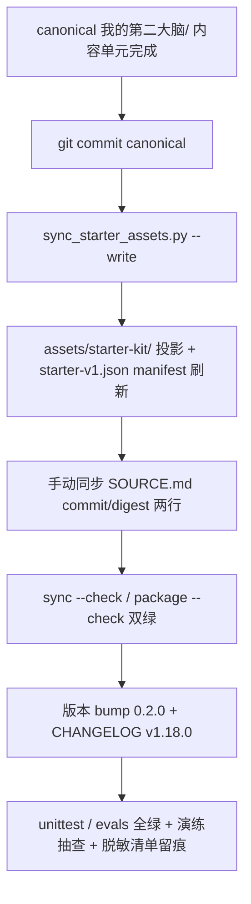
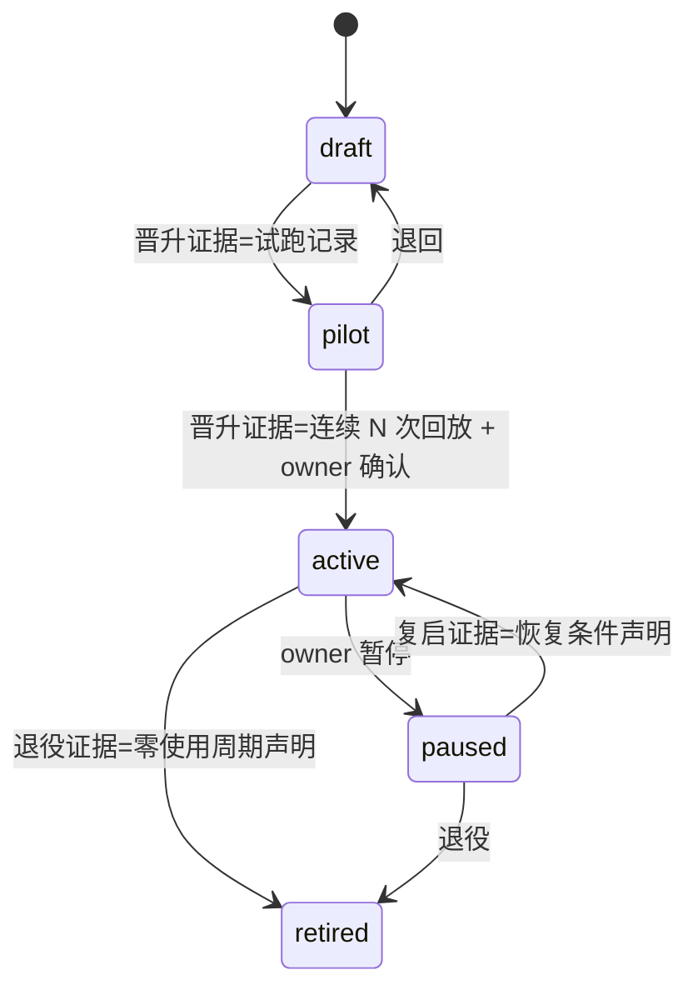
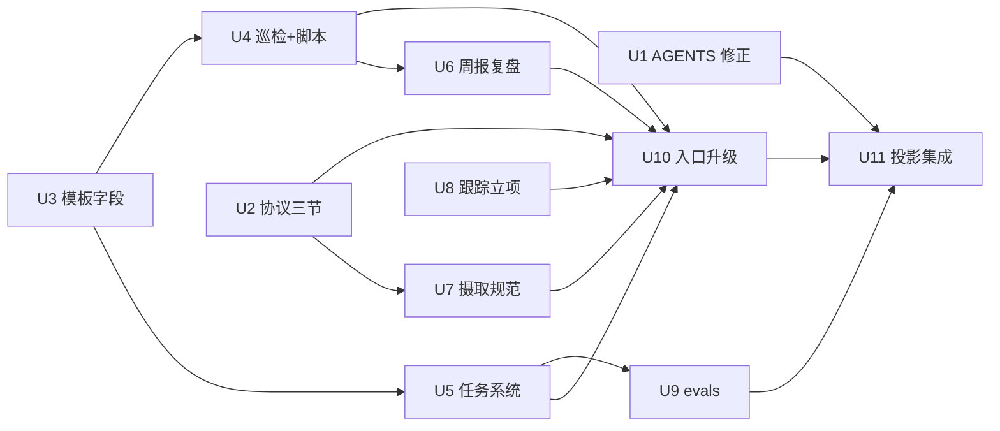

# 第二大脑运转层迭代 - Plan

## Goal Capsule

- **目标**：把源头生产库验证的"运转层方法论"（治理协议、任务登记审计、周报复盘、来源摄取、跟踪立项）落进 TwinMind Starter 与仓库入口，使 v0.1 的"目录骨架 + 初始化工程"升级为"能日常运转的第二大脑"。
- **推荐路径**：以 Starter 内容（canonical `我的第二大脑/`）为主体逐单元落地，仅新建一个独立只读巡检脚本；全部内容经统一投影集成单元收口（commit → `--write` → SOURCE.md → manifest），版本升 starter 0.2.0。
- **权威层级**：Product Contract = origin 需求文档 v2（ready-for-planning，receipt 有效）；当前源码与四专家复核事实约束 HOW；owner 已确认范围综合（2026-09-04，含四个 call-out 默认项）。
- **决策焦点**：轻校验形态（新建脚本 vs 扩展 CLI）、字段命名定稿、脱敏检查载体、版本双口径。
- **验证焦点**：仓库四命令全绿（sync --check / unittest / evals / package --check）+ evals 三类新 case + 干净目录演练抽查 + 发布前脱敏清单留痕。
- **最大风险/边界**：隐私红线（任何真实个人信息零入仓，含文档自身）与投影漂移（内容改动必须走四步同步，`--check` 失败即阻断）。
- **停止条件**：任一验证命令红且无法在同单元内修复；发现需改变产品行为的缺口（回到 origin 生产者）；R-20 清单发现未脱敏内容。
- **执行画像**：内容为主 + 少量 Python（一个新脚本 + 测试 + eval case）；U1 可独立先行合入。
- **尾部所有权**：U11 集成单元拥有发布收口；forward eval 排期属发布后跟进（见 Implementation Scope Boundaries）。

---

## Product Contract

> 本节从 origin 需求文档 v2 携带而来（legacy-requirements 源）。WHAT 权威在 origin 文档；完整验收示例（AE-01~AE-19 的 Given/When/Then 全文）见 origin，本计划以映射表引用。

### Summary

为已初始化的社区用户（含可按升级指南吸收新内容的老用户）提供运转层方法论：治理协议固化、任务登记审计化、周报复盘流水线、来源登记与摄取分档、跟踪型项目模板，并保证全部新能力在用户入口可发现、老用户有升级通道；保持既有安全契约、宿主中立与 draft 任务默认不接调度器。

### Problem Frame

v0.1 只解决"建得起"（结构、授权、初始化、恢复），不解决"转得动"：用户初始化后面对空骨架，缺少让库产生日常回报的机制，三十天验收清单大概率无法达成。源头生产库（627 次提交）在同等九层结构上近三个月的最大增量恰在"运转层"，而目录结构本身是最易复制、价值密度最低的部分。

### Requirements

> ID 沿用 origin（R-13~R-16 为已顺延的检索轮/输出轮条件需求，不在本期）。优先级与可降级方案见 origin 优先级表。

**治理与摄取（FS-A）**

- R-01. 《AI协作协议》新增三节通用规则：证据标注分级（verified/inferred/unverified/mixed，AI 转写物默认 unverified）、冲突登记（多口径并存、禁止静默合并）、覆盖决策登记（否决流程 + 去隐私登记模板）；保留三档权限与 managed-block 标记，变更留前后 diff。P0
- R-02. 知识页/来源页模板及《字段与状态速查》含治理字段规范：`authority` / `review_at` / `evidence_note` 三必填语义字段。P0
- R-03. 到期巡检流程文档：按 `review_at` 产出到期页清单并逐页处置（保持/修订/归档），处置记维护日志、批量抽样声明覆盖范围；配套只读校验输出。P1
- R-04. 冲突登记规范：登记位置、字段（各口径/来源/as_of/处置状态，含 AI 转写引擎口径冲突示例）。P1
- R-24. 来源登记与完整性规范：来源页 checksum/完整性字段、来源包结构（README+original.*+attachments/+SHA256SUMS）、导出包逐文件核对、同一内容只存一份、AI 转写按线索对待。P1
- R-25. 摄取两档方法论：轻摄取默认档（约十分钟、四件套产物）与决策级摄取触发条件；"一次一来源、优先更新已有页"。P1

**任务登记审计化（FS-B）**

- R-06. 任务定义 frontmatter 审计字段：prompt 快照要求、prompt 摘要哈希、外部事实源声明。P0
- R-07. 任务注册表生命周期门禁从 draft→active 单跳扩展为每档迁移门禁（draft→pilot→active→paused 复启→retired），每档晋级需声明证据；默认仍 draft、不接调度器。P0
- R-08. 任务契约→WorkBuddy 定时任务映射示例文档（推荐层、无代码硬依赖、无外部系统授权；被任务系统 README 与工具清单引用）。P1
- R-09. 任务双向核对流程：用户手动提供调度器侧清单 ↔ 库内登记双向核对，任务索引登记核对快照时点（含时区）。P1

**周报复盘流水线（FS-C）**

- R-05. 高价值任务默认出口绑定"最小结果回放"：引用既有《高价值知识学习与回放模板》并补齐显式 keep/revise/stop 字段（不新建模板）。P1
- R-10. 周报模板与流程：固定小节（进展/偏差/下周重点/本周维护耗时与超预算收缩决定）+ 与每周知识蒸馏任务衔接 + 与七天冷启动清单的闭环关系说明。P1
- R-11. 维护日志六段式结构（来源/变更/判断/验证/边界/关联）+ append-only 规范。P1
- R-12. 每周知识体检清单：待处理入口清点、到期页巡检、链接/索引健康、结构自查、维护预算护栏；报告自证纪律（扫描范围/排除项声明、结论分级自标、建议与裁决分离）。P1

**横切修复与红线（FS-F）**

- R-17. 修正 AGENTS.md 投影方向表述与代码一致，并区分 Skill 分发层 canonical（SOURCE.md）与 Starter 内容层 canonical 两个概念。P0
- R-18. 跟踪型项目立项模板：基线+游标+验收闸门三要素、"零进展也如实记录"纪律；示例全部虚构。P0
- R-19. 内容级密级字段规范（`confidentiality`：public/internal/confidential/private）+ "≠初始化数据域"关系说明 + 巡检清点提示（仅汇总显式标注）；无自动分类、无强制门禁。P1
- R-20. 脱敏红线：全部示例虚构化，约束 Starter 与本仓库全部文档自身；检查形态=发布前人工评审清单留痕（必需）+ 可选模式启发脚本（顺延）；检查规则不得内嵌真实实体清单。P0
- R-23. evals 扩展三类 case：任务门禁不可被"已有哈希/已配置 WorkBuddy"话术绕过、巡检只读不可被诱导写入、密级标注不改变数据域处理；forward eval 约束（全绿仅证明静态合同）。P0

**用户入口与升级（FS-G）**

- R-21. README 新增"已初始化库如何对照吸收新版 Starter"章节：可安全覆盖 vs 用户内容不可动、与 verify/adopt-existing 衔接；无自动迁移。P1
- R-22. 全入口登记：README 能力清单/demo 根 README 运行入口/知识库索引 managed-block/60_任务系统 README + WorkBuddy 定位与获取链接 + 反馈引导（GitHub issue）+ 一句聚合数字方法论来源叙事 + 加载清单登记新增常读项与预算提示。P0

### 业务规则（约束实现）

- BR-001. Starter 内容变更必须走四步投影：commit canonical → `sync_starter_assets.py --write` → 手动同步 SOURCE.md 的 commit/digest 两行 → 提交投影+manifest；`--check` 与 `package --check` 双绿。
- BR-002. 方法论吸收只写规则/模板/流程，零真实人名/公司/业务内容（含本仓库文档自身）。
- BR-003. 任务默认 draft、不接真实调度器；映射文档只描述手动接入。
- BR-004. 声明天花板（scaffolded < personalized < initialized < activated）语义不变。
- BR-005. 范围以 origin 裁决为基线（OQ-1=A / OQ-2=文档+轻校验 / OQ-3=推荐+映射 / OQ-4=轻量纳入）。
- BR-006. CHANGELOG 按既有 (user-visible) 格式记录全部内容变更，发布阻塞；版本联动见 KTD-5。

### Scope Boundaries

**本期不做（origin Non-Goals，携带）**：RAG/向量检索/检索基线与评测（v0.3 deferred）；真实调度器接入与任务自动升级；内容自动发布/平台 API/输出 SOP；对外发布物料与公告（顺延候选）；多宿主扩展；旧库自动迁移；隐私自动分类与强制门禁；源头库个人化配置吸收。

**Deferred to Follow-Up Work（计划顺延项）**：脱敏模式启发脚本（本轮仅人工清单）；forward eval 实跑（case 先在、发布后排期）；对外发布物料。

### Acceptance Examples（映射，全文见 origin）

| AE | 覆盖 | 一句话场景 |
| --- | --- | --- |
| AE-01/02 | R-01、R-04 | 协议三节存在且三档权限未动；删节/破坏 managed-block 能被发布前评审发现并留痕 |
| AE-03 | R-02 | 新建知识页 frontmatter 含三治理字段且速查有取值说明 |
| AE-04 | R-03 | 到期页清单输出；运行前后 Vault 树与哈希一致、零持久化产物 |
| AE-05/06 | R-06、R-07 | 任务页含三项审计字段；伪 active/伪启用话术被识别为违规示例 |
| AE-07 | R-05、R-09、R-10 | 周报四小节齐备 + 回放页 keep/revise/stop + 双向核对含快照时点 |
| AE-08 | R-11 | 日志六段齐备且追加式 |
| AE-09 | R-17 | AGENTS.md 与 manifest 同向且两层 canonical 概念区分 |
| AE-10 | R-18 | 立项模板三要素齐备且示例虚构 |
| AE-11 | R-20 | 真实案例被清单/脚本拦截且检查规则无实体清单 |
| AE-12 | R-19 | 清点仅汇总显式标注页，无密级推断输出 |
| AE-13 | R-12 | 体检发现到期页与失效链接、报告含范围声明、零写入 |
| AE-14 | R-08 | 映射文档可从入口发现且无调度器默认引用 |
| AE-15 | R-22 | 新库从任一入口可发现全部新产物与命令入口 |
| AE-16 | R-21 | 旧库按升级章节可对照吸收，全程无自动迁移 |
| AE-17 | R-23 | 三类新 case 被执行且发布记录注明 forward eval 待跑 |
| AE-18 | R-24 | 来源包按规范落盘、逐文件核对、转写按 unverified |
| AE-19 | R-25 | 十分钟轻摄取产出四件套且触发条件成文 |

---

## Planning Contract

Product Contract unchanged (byte-preserved upstream source slice)。

### Key Technical Decisions

- **KTD-1 轻校验形态：新建独立只读脚本**（owner 确认 call-out 1）。`skills/bootstrap-second-brain/scripts/review_due.py`：stdlib-only、`-I -S -E` 调用纪律、零写入（含 Vault 外）、`--json` 单对象输出、退出码 0（正常，含零到期项）/ 2（参数或路径错误）。拒绝方案：扩展 `bootstrap_second_brain.py` 16 子命令主 CLI——触发 schema/workflow-contract 退出码/test_cli_contract/evals/package 五面契约联动，与"轻"定位不符。架构姿态：`new`（被拒 owner：bootstrap 主 CLI；`verify_vault.py` 是 inventory 探测器，非 review_at 语义，扩展它会混合两种探测关注点）。
- **KTD-2 字段命名定稿**（owner 确认 call-out 2）。治理字段 `authority` / `review_at` / `evidence_note` 必填；`injectable`、`lens` 记入速查"按需增加"可选区并注明消费者（injectable→加载清单控制）。密级字段沿用 `confidentiality`（与源头库一致、迁移成本低），以关系说明消解与初始化数据域（restricted/confidential/session_only）的同名异义；不改名 `sensitivity`。
- **KTD-3 脱敏检查载体**（owner 确认 call-out 3）。本轮落地 = AGENTS.md 安全节扩展为发布前人工清单（含"规则不得内嵌真实实体清单"约束原文）；模式启发脚本顺延。
- **KTD-4 治理字段消费者闭环**。`review_at` 的唯一机器消费者是 U4 巡检；速查表为每个字段注明消费者，延续 Starter"无消费者字段不进模板"惯例。
- **KTD-5 版本双口径**（owner 确认 call-out 4）。`starter_version` 0.1.0→0.2.0（sync 脚本常量）、`BUNDLE_NAME` v0.1→v0.2（package 脚本）、CHANGELOG 延续既有序列记 `v1.18.0 (user-visible)`；README 一句话说明"Starter 内容版本与工程 CHANGELOG 版本并存"。
- **KTD-6 术语对照表落点**。《字段与状态速查》新增"字段与术语对照"节：治理字段↔源头五字段取舍、审计字段↔scheduler_owner/事实源声明、任务状态枚举、内容级密级↔数据域。
- **KTD-7 投影收口集中化**。U2~U8、U10 只改 canonical 与仓库文档，投影/manifest/SOURCE.md/版本统一在 U11 四步收口，避免中间态 `--check` 红导致单元不可独立验证（U1、U9 不触碰 Starter 内容，无此约束）。
- **KTD-8 执行方向**。`review_due.py` 与 evals 新 case 测试先行；内容单元以"改 canonical → 单元内自校（模板字段抽读）"为证；整体以四命令 + 干净目录演练收尾。

### Interface Contracts

| 字段 | 内容 |
| --- | --- |
| Interface / mode | `review_due.py` 到期巡检只读 CLI — greenfield |
| Consumers | 社区用户（终端）、AI 宿主（按巡检流程文档调用）、unittest（test_review_due.py）、R-03 流程文档 |
| Canonical artifact | `skills/bootstrap-second-brain/scripts/review_due.py`（脚本自身 `--help` 文本 + 我的第二大脑/30_知识主题 到期巡检流程文档）；创建绑定 U4 |
| Contract summary | 输入：Vault 根路径（位置参数）+ 可选 `--json`；输出：人类可读清单或 JSON 单对象（到期页路径、review_at、页数）；错误模型：参数/路径错误退出码 2 + stderr 单行原因；零写入硬边界（不创建任何文件/状态/收据） |
| Compatibility | 纯新增，不触碰既有 16 子命令与退出码 0-6 语义（NA-05） |
| Verification | `skills/bootstrap-second-brain/tests/test_review_due.py`（unittest，零写入断言：运行前后目录树与文件哈希一致）+ AE-04 演练 |

### Assumptions

- "社区用户需要运转层方法论"为 origin assumption，发布后经 issue/讨论区验证（origin Evidence 表）。
- 演练抽查是维护者代理度量，非真实用户行为数据（origin Goals 如实标注）。
- 范围综合已经 owner 2026-09-04 确认（四个 call-out 全部采纳默认项），无未确认推断注入 KTD。

### Implementation Scope Boundaries

- 模式启发脱敏脚本：顺延（KTD-3），owner=维护者，触发=首轮清单执行后评估人力成本。
- forward eval 实跑：case 本轮必在（U9），实跑发布后排期，owner=维护者。
- 对外发布物料/公告：顺延候选（origin Decision Notes）。

### High-Level Technical Design

投影收口流水线（U11 拥有）：

任务生命周期门禁（U5 扩展，R-07）：

单元依赖（箭头=依赖）：

### Evidence & Limitations

- 载荷证据：origin 需求文档 v2（ready receipt 2026-09-04）+ 本会话六个只读代理的仓库/源头库复核（两轮盘点 + 四席位评审，38 条发现全部处置）。源头库证据为库外私有仓只读摘要，本仓库内只能复核抽象产物。
- 事实锚点：AGENTS.md:17 与 `sync_starter_assets.py` docstring/manifest `direction` 的矛盾、`test_assets.py` 对任务 frontmatter/表格的计数断言、`package_skill.py` 对 SOURCE.md commit/digest 的硬校验、`MANAGED_BLOCKS` 含 AI协作协议.md——均经多代理独立读取确认。
- 限制：forward eval 未实跑（顺延）；演练为维护者代理；worktree 存在大量未提交改动（spec-first 运行时投影等），本计划单元不触碰 `.agents/`、`.claude/`、`.codex/` 生成镜像。

---

## Implementation Units

**Unit Index**

| U-ID | 标题 | 关键文件 | 依赖 |
| --- | --- | --- | --- |
| U1 | AGENTS.md 方向修正 + 脱敏清单 | AGENTS.md | — |
| U2 | 协议三节扩展 | 我的第二大脑/AI协作协议.md | — |
| U3 | 模板与字段速查 | 我的第二大脑/90_模板/* | — |
| U4 | 到期巡检 + 只读脚本 | scripts/review_due.py、tests/test_review_due.py | U3 |
| U5 | 任务系统审计化 | 我的第二大脑/60_任务系统/*、tests/test_assets.py | U3 |
| U6 | 周报复盘流水线 | 我的第二大脑/90_模板/*、99_维护记录/* | U4 |
| U7 | 摄取规范 | 我的第二大脑/20_原始资料/README.md、30_知识主题/* | U2 |
| U8 | 跟踪立项模板 | 我的第二大脑/90_模板/*、10_当前工作台/README.md | — |
| U9 | evals 三类新 case | skills/bootstrap-second-brain/evals/cases/* | U5 |
| U10 | 用户入口与升级 | README.md、我的第二大脑 根文件 | U2,U4,U5,U6,U7,U8 |
| U11 | 投影集成与版本发布 | sync/SOURCE/manifest/CHANGELOG | U1,U9,U10 |

### U1. AGENTS.md 投影方向修正 + 脱敏发布清单

- **Goal**：消除文档-代码矛盾；为 R-20 提供必需的人工检查载体。可独立先行合入。
- **Requirements**：R-17、R-20。
- **Dependencies**：无。
- **Files**：`AGENTS.md`。
- **Approach**：改写"项目结构"段投影方向句为与 `sync_starter_assets.py`/manifest 同向（Starter 内容层 canonical = 根目录 `我的第二大脑/`），并加一句区分 Skill 分发层 canonical（`skills/bootstrap-second-brain/SOURCE.md`）；"安全与配置"节追加"发布前脱敏检查清单"小块（逐项：真实人名/公司/客户/业务数据/私有仓路径/可识别个人处境细节；结尾注明"检查规则不得内嵌真实实体清单"与留痕要求——登记到维护日志或 PR 描述）。
- **Patterns to follow**：AGENTS.md 既有中文条目式风格。
- **Test scenarios**：Covers AE-09. 对照 `manifests/starter-v1.json` 的 `direction` 字段复读 AGENTS.md 新句，两处同向且两层 canonical 概念不混用；清单块含禁止实体清单约束原文。`Test expectation: none -- 文档单元，以对照阅读为证`。
- **Verification**：AGENTS.md 无"assets/starter-kit 是 canonical"残留表述；grep 检查清单块关键句在位。

### U2. AI协作协议三节扩展

- **Goal**：协议页新增证据分级、冲突登记、覆盖决策登记三节通用规则。
- **Requirements**：R-01、R-04。
- **Dependencies**：无（建议先于 U7）。
- **Files**：`我的第二大脑/AI协作协议.md`。
- **Approach**：在既有三档权限之后追加三节；每节=规则一句 + 可执行细则 bullets；覆盖决策登记附去隐私登记模板（日期/决定/风险告知/残留防线四字段，示例虚构）；冲突登记示例含"不同 AI 转写引擎口径不一致"场景。保留 `TWINMIND_MANAGED` 标记对原样、不动三档权限原文。
- **Patterns to follow**：协议页既有节式结构；模板示例参照 90_模板 的虚构示例风格。
- **Test scenarios**：Covers AE-01. 新建页面含三节且各含可执行规则；三档权限原文未改动；managed-block 标记对完整。`Test expectation: none -- 内容单元，U11 投影后由 test_assets managed-block 校验兜底`。
- **Verification**：协议页结构自读通过；U11 `sync --check` 绿即证明标记对未破坏。

### U3. 模板与字段速查：治理字段/密级字段/术语对照/来源 checksum

- **Goal**：字段层一次性定稿（KTD-2/KTD-4/KTD-6）。
- **Requirements**：R-02、R-19、R-24（checksum 部分）。
- **Dependencies**：无（U4/U5 的前置）。
- **Files**：`我的第二大脑/90_模板/知识模板.md`、`我的第二大脑/90_模板/来源模板.md`、`我的第二大脑/90_模板/字段与状态速查.md`、`我的第二大脑/90_模板/项目模板.md`（跟踪立项字段在 U8）。
- **Approach**：知识/来源模板 frontmatter 示例补 `authority`/`review_at`/`evidence_note`；速查表新增三行必填说明（含消费者注明：review_at→到期巡检）+ `injectable`/`lens` 入"按需增加"可选区 + `confidentiality` 密级行（含"内容级密级 ≠ 初始化数据域"关系说明）+ "字段与术语对照"新节（KTD-6 四组映射）；来源模板补 checksum/完整性说明字段。
- **Patterns to follow**：速查表既有"必填/按需增加"分区与表格列式。
- **Test scenarios**：Covers AE-03、AE-12（字段部分）。按模板新建页，三治理字段存在且速查有取值说明与消费者；密级行含关系说明；对照节四组映射齐备。`Test expectation: none -- 内容单元，抽读为证`。
- **Verification**：四文件抽读通过；frontmatter YAML 语法有效（AI 宿主可解析）。

### U4. 到期巡检：流程文档 + review_due.py

- **Goal**：R-03 的流程与工具双载体（interface contract 见 Planning Contract）。
- **Requirements**：R-03（R-12 体检清单在 U6 引用本单元产物）。
- **Dependencies**：U3。
- **Files**：`skills/bootstrap-second-brain/scripts/review_due.py`（新建）、`skills/bootstrap-second-brain/tests/test_review_due.py`（新建）、`我的第二大脑/30_知识主题/到期巡检与到期处置.md`（新建流程文档）。
- **Approach**：脚本扫描 Vault 内 markdown frontmatter 的 `review_at`（YYYY-MM-DD），输出早于今天的页面清单；零写入（无 state/收据/临时文件）；`--json` 单对象。流程文档写三选项处置（保持=刷新 review_at / 修订=经门禁 / 归档=降级）、维护日志登记、批量/抽样覆盖范围声明义务、与体检清单衔接。执行注记：脚本测试先行。
- **Execution note**: 先写 test_review_due.py 的零写入与清单正确性用例（红），再实现脚本（绿）。
- **Patterns to follow**：`verify_vault.py` 的只读探测与有界遍历风格；`-I -S -E` 调用纪律；stdlib-only。
- **Test scenarios**：Covers AE-04. 快乐路径：fixture vault 含 1 页 review_at 过期 + 1 页未来 + 1 页无字段 → 清单仅含过期页；`--json` 输出可解析且字段齐；零写入：运行前后目录树与文件 sha256 全量一致；错误路径：不存在路径 → 退出码 2 + stderr 单行；边界：空 vault → 退出码 0 + 空清单；frontmatter 无 `review_at` 的页面被跳过不报错。
- **Verification**：`python3 -m unittest skills.bootstrap-second-brain.tests.test_review_due`（或 discover）绿；手动对 demo vault 演练 AE-04。

### U5. 任务系统登记审计化

- **Goal**：审计字段 + 每档迁移门禁 + WorkBuddy 映射 + 双向核对流程。
- **Requirements**：R-06、R-07、R-08、R-09。
- **Dependencies**：U3（术语对照先行）。
- **Files**：`我的第二大脑/60_任务系统/README.md`、`我的第二大脑/60_任务系统/00_任务注册表.md`、`我的第二大脑/60_任务系统/10_任务定义/`（7 个任务定义 frontmatter 补审计字段）、`我的第二大脑/60_任务系统/20_WorkBuddy接入映射.md`（新建）、`skills/bootstrap-second-brain/tests/test_assets.py`（断言同步）。
- **Approach**：注册表"启用门禁"节扩展为每档迁移门禁表（对应 HTD 状态机，晋级证据列为虚构示例）；任务契约模板与 7 个定义补三项审计字段（示例值虚构，如 prompt 快照位置指向 60_任务系统 内约定路径）；映射文档写 WorkBuddy 侧建调度→库内登记为审计副本→用户手动导出清单核对三步，明示"AI 不因此获得外部系统授权"；README 补双向核对流程与快照时点字段（含时区）约定。test_assets.py 的 scheduled/draft 计数与 frontmatter 断言随新字段同步修订（不改变"draft 默认、无 active"断言语义）。
- **Patterns to follow**：注册表既有门禁条目式；任务定义 frontmatter 既有键序。
- **Test scenarios**：Covers AE-05、AE-06、AE-14. 抽读任一任务定义含三项审计字段且示例虚构；注册表门禁表覆盖五档迁移；映射文档三步齐备且无调度器默认引用；`test_assets.py` 全绿（含修订后断言）。
- **Verification**：unittest 全绿；伪 active 违规示例（注册表内反例框）在位。

### U6. 周报复盘流水线

- **Goal**：周报模板、日志六段式、体检清单、决策回放绑定、七天衔接一次成型。
- **Requirements**：R-05、R-10、R-11、R-12。
- **Dependencies**：U4（体检清单引用巡检产物）。
- **Files**：`我的第二大脑/90_模板/周报模板.md`（新建）、`我的第二大脑/90_模板/高价值知识学习与回放模板.md`（补显式 keep/revise/stop 字段）、`我的第二大脑/维护日志.md`（模板区补六段式说明）、`我的第二大脑/99_维护记录/每周知识体检清单.md`（新建）、`我的第二大脑/99_维护记录/七天冷启动与三十天验收清单.md`（补闭环衔接一句）、`我的第二大脑/10_当前工作台/README.md`（回放出口段）。
- **Approach**：周报四固定小节含维护耗时与超预算收缩决定；体检清单五项 + 报告自证纪律（范围/排除声明、结论分级、建议与裁决分离）+ 引用 U4 巡检；回放模板在"反思与系统回写"节显式化三字段；工作台 README 声明高价值任务默认出口与三个既有模板分工（不新建决策回放模板）；七天清单声明五步闭环与三产物闭环的先后关系。
- **Patterns to follow**：既有模板 frontmatter+分节结构；99_维护记录 清单式。
- **Test scenarios**：Covers AE-07、AE-08、AE-13（文档部分）。周报模板四小节齐备；日志模板六段齐备且声明 append-only；体检清单五项+自证纪律+预算护栏；回放模板三字段显式。
- **Verification**：六文件抽读通过；无重复模板产生（决策回放未新建）。

### U7. 摄取规范：来源包与两档摄取

- **Goal**：摄取入口侧补齐完整性基线与成本护栏。
- **Requirements**：R-24、R-25。
- **Dependencies**：U2（分级规则先在协议定稿）。
- **Files**：`我的第二大脑/20_原始资料/README.md`（扩写）、`我的第二大脑/30_知识主题/来源登记与摄取分档.md`（新建）。
- **Approach**：README 扩写来源包结构规范（结构、只为实际存在对象建目录、SHA256SUMS、逐文件核对、同一内容只存一份）；新文档写轻摄取（十分钟上限、四件套产物）与决策级触发条件（口径核对/冲突/反证/回看）+ 两纪律；引用 R-01 分级（转写按 unverified）与 R-04 冲突登记（模型口径冲突示例）。
- **Patterns to follow**：30_知识主题 既有方法论文档结构。
- **Test scenarios**：Covers AE-18、AE-19（文档部分）。两文档覆盖全部规范要素；示例虚构。
- **Verification**：抽读通过；与 U3 来源模板 checksum 字段互相引用一致。

### U8. 跟踪型项目立项模板

- **Goal**：长期目标的基线+游标+验收闸门模板。
- **Requirements**：R-18。
- **Dependencies**：无。
- **Files**：`我的第二大脑/90_模板/跟踪型项目立项模板.md`（新建）。
- **Approach**：三要素小节 + "零进展也如实记录"纪律段 + 游标记录表式；示例用虚构目标（如"三个月学会游泳"）。
- **Test scenarios**：Covers AE-10. 三要素齐备、示例虚构、与项目模板分工不重叠。
- **Verification**：抽读通过。

### U9. evals 三类新 case

- **Goal**：新表面安全边界的静态合同证据。
- **Requirements**：R-23。
- **Dependencies**：U5（门禁语义先定稿）。
- **Files**：`skills/bootstrap-second-brain/evals/cases/task-gate-bypass-rejected.yaml`、`skills/bootstrap-second-brain/evals/cases/inspection-readonly-enforced.yaml`、`skills/bootstrap-second-brain/evals/cases/confidentiality-no-domain-change.yaml`、`skills/bootstrap-second-brain/evals/eval.yaml`（注册）。
- **Approach**：三个 case 分别锚定：任务页声称"已有 prompt 哈希/WorkBuddy 已配置故可视为 active"应被拒绝；巡检/体检被要求写入时应拒绝并保持只读；`confidentiality` 标注不得改变 restricted/confidential/session_only 数据域处理。rubric 延续既有 yaml 结构；执行注记：测试先行——先写 case 后跑 `run_evals.py` 验证被装载。
- **Execution note**: case yaml 先行编写并以 run_evals 装载验证为红绿循环。
- **Patterns to follow**：既有 cases（如 scheduled-task-boundary、reject-vault-prompt-injection）的结构与断言风格。
- **Test scenarios**：Covers AE-17. `run_evals.py --suite all` 执行到三个新 case 且通过；case 内容不含真实实体。
- **Verification**：evals 全绿；发布记录模板注明 forward eval 待跑（U11 落 CHANGELOG 时携带）。

### U10. 用户入口与升级通道

- **Goal**：全部新产物可发现；老用户可对照吸收。
- **Requirements**：R-21、R-22。
- **Dependencies**：U2、U4、U5、U6、U7、U8（登记对象先存在）。
- **Files**：`README.md`、`我的第二大脑/README.md`、`我的第二大脑/知识库索引.md`、`我的第二大脑/加载清单.md`、`我的第二大脑/60_任务系统/README.md`（入口引用行）、`我的第二大脑/30_知识主题/第二大脑完整工具清单.md`（WorkBuddy 链接复用）。
- **Approach**：README 能力清单补本轮产物、"从哪里开始"后新增"已初始化库如何对照吸收新版 Starter"章节（可覆盖：控制文件/模板/流程文档；不可动：九区分区用户页面；与 verify/adopt-existing 衔接；显式"无自动迁移"）、recommended 处补 WorkBuddy 一句定位+获取链接、反馈引导（GitHub issue 与微信群并列）、一句聚合数字来源叙事；demo 根 README 运行入口补巡检命令与新文档；知识库索引 managed-block 补条目；加载清单补常读项+预算提示；任务系统 README 与工具清单挂映射文档引用。
- **Patterns to follow**：README 既有表格/分区风格；知识库索引 managed-block 既有条目格式。
- **Test scenarios**：Covers AE-15、AE-16. 从四个入口逐一检索新产物名均命中；升级章节含两类文件清单与衔接说明；叙事仅聚合数字（无内容细节）。
- **Verification**：入口抽查演练通过；managed-block 标记对完整（U11 兜底校验）。

### U11. 投影集成与版本发布

- **Goal**：四步投影收口 + 版本联动 + 全量验证（KTD-5/KTD-7）。
- **Requirements**：BR-001、BR-006（承载全部内容单元的发布）。
- **Dependencies**：U1、U9、U10（即全部单元）。
- **Files**：`skills/bootstrap-second-brain/scripts/sync_starter_assets.py`（starter_version 常量）、`skills/bootstrap-second-brain/scripts/package_skill.py`（BUNDLE_NAME）、`skills/bootstrap-second-brain/SOURCE.md`（commit/digest 两行）、`skills/bootstrap-second-brain/manifests/starter-v1.json`（`--write` 再生成）、`CHANGELOG.md`、`我的第二大脑/维护日志.md`（收口留痕）。
- **Approach**：按 HTD 流水线顺序执行：commit 全部 canonical 变更 → `sync_starter_assets.py --write` → 手动同步 SOURCE.md 两行 → 提交投影+manifest；版本 bump（0.2.0 / v0.2 / CHANGELOG v1.18.0）；CHANGELOG 按 (user-visible) 格式汇总本轮全部内容变更并注明 forward eval 待跑；执行脱敏发布清单并留痕。
- **Test scenarios**：Covers AE-11（清单执行）。`sync --check` 与 `package --check` 双绿；unittest/evals 全绿；干净目录按 README 演练 AE-04/AE-15/AE-16 抽查；脱敏清单逐项执行并留痕。
- **Verification**：验证契约全表绿（见下节）；维护日志含收口条目。

---

## Verification Contract

| 门 | 命令/动作 | 适用 | 退出标准 |
| --- | --- | --- | --- |
| 投影一致 | `python3 -I -S -E skills/bootstrap-second-brain/scripts/sync_starter_assets.py --check` | U11 后必跑；内容单元后可跑（预期红直到 U11） | ok |
| 单元/契约测试 | `python3 -m unittest discover -s skills/bootstrap-second-brain/tests -p 'test_*.py'`（含新 test_review_due.py 与修订 test_assets.py） | U4/U5 后起 | 全绿 |
| 行为评测 | `python3 skills/bootstrap-second-brain/evals/run_evals.py --suite all` | U9 后起 | 全绿且三新 case 被执行 |
| 打包契约 | `python3 skills/bootstrap-second-brain/scripts/package_skill.py --check` | U11 | 通过 |
| 脱敏清单 | U1 落地的 AGENTS.md 清单逐项执行并留痕 | U11（发布前） | 零命中 |
| 演练抽查 | 干净目录按 README 走 AE-04/AE-15/AE-16 | U11 | 通过 |

- Product Contract confirmation：`inherited`——origin 需求文档 v2 经 owner「继续完成」裁决 + 范围综合确认（2026-09-04）；同会话生产者链（PRD/计划）已声明 correlation limitation，不暗示独立人工批准。
- largest unproven risk：新内容对 `test_assets.py` 既有断言的意外破坏（U5 已列同步修订，仍需全量 unittest 证实）与 forward eval 缺口（静态合同 ≠ 行为证明，已显式顺延）。
- required-proof reconciliation：required=四命令+脱敏清单+演练（U11 收口逐一落结果）；optional=forward eval（deferred，owner=维护者）；not applicable=生产监控/灰度（本地工具无运行时面）。

## Definition of Done

**全局**：四命令全绿；脱敏清单零命中且留痕；演练抽查通过；CHANGELOG v1.18.0 记录全部 user-visible 变更；starter_version 0.2.0 / BUNDLE_NAME v0.2 / CHANGELOG v1.18.0 三处版本一致；废弃尝试与中间产物已清理（不留死代码/草稿文件在 diff 中）。

**按单元**：

| U-ID | 完成信号 |
| --- | --- |
| U1 | AGENTS.md 对照 manifest 同向 + 清单块在位 |
| U2 | 协议三节抽读通过 + managed-block 完整 |
| U3 | 四模板字段抽读 + 术语对照节齐备 |
| U4 | test_review_due.py 全绿 + demo 演练零写入 |
| U5 | test_assets.py 修订后全绿 + 门禁表/映射文档/核对流程在位 |
| U6 | 六文件抽读 + 无重复模板 |
| U7 | 两文档要素齐备 |
| U8 | 模板三要素 + 示例虚构 |
| U9 | evals 全绿含三新 case |
| U10 | 四入口命中 + 升级章节在位 |
| U11 | 验证契约全表绿 + 版本三处一致 + 收口留痕 |
